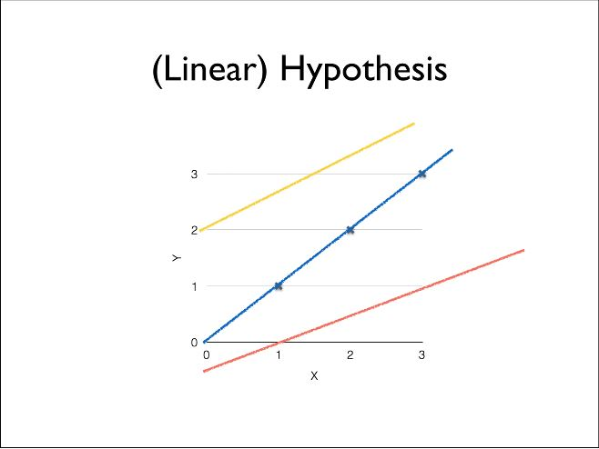
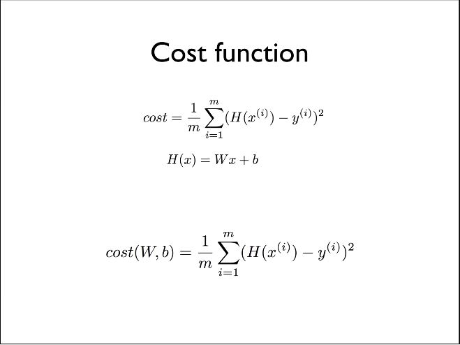
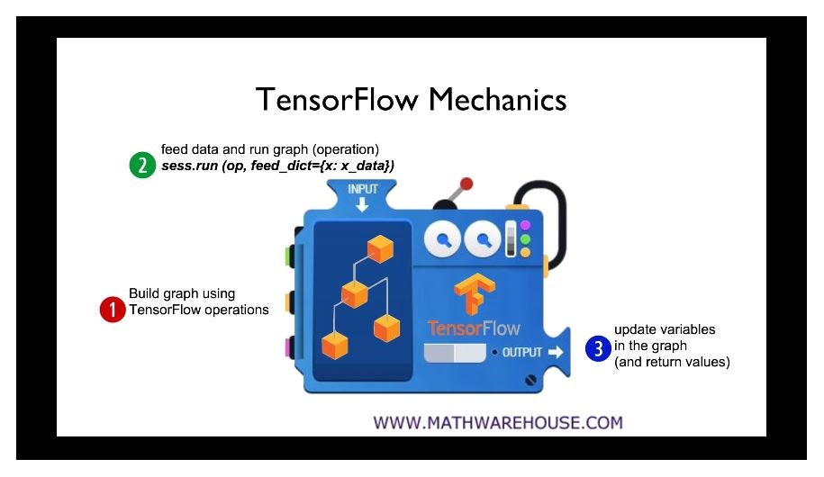

# Section 2. Linear Regression의 개념

## 1. Linear Regression의 Hypothesis와 cost

### 1.1. Acknowledgement

- Andrew Ng's ML class
  - https://class.coursera.org/ml-003/lecture
  - http://www.holehouse.org/mlclass/ (note)
- Convolutional Neural Networks for Visual Recognition.
  - http://cs23ln.github.io/
- Tensorflow
  - https://www.tensorflow.org
  - https://github.com/aymericadamien/TensorFlow-Examples


### 1.2. Predictiong exam score: regression

| x (hours) | y (score) |
| :-------: | :-------: |
|    10     |    90     |
|     9     |    80     |
|     3     |    50     |
|     2     |    30     |

linear regression


#### 1.2.1. Regression (data)

|  x   |  y   |
| :--: | :--: |
|  1   |  1   |
|  2   |  2   |
|  3   |  3   |

graph TD A[Christmas] -->|Get money| B(Go shopping)




#### 1.2.2. Which hypothesis is better?

H(x) = wx + b


### 1.3. Cost function

- How fit the line to our (training) data
  - H(x) - y, 별로 좋지 않은 방법
  - (H(x) - y)<sup>data</sup>
  - (H(x<sup>(1)</sup>) - y<sup>(1)</sup>)<sup>2</sup> + (H(x<sup>(2)</sup>) - y<sup>(2)</sup>)<sup>2</sup> + (H(x<sup>(3)</sup>) - y<sup>(3)</sup>)<sup>2</sup>



Hypothesis and cost function

추청, 비용 함수


#### 1.3.1. Goal: Minimize cost

minimize cost(W, b) => 학습의 목표


## 2. Linear Regression의 cost 최소화의 TensorFlow 구현(new)

https://github.com/hunkim/DeepLearningZeroToAll/

### 2.1. TensorFlow Mechanics



#### 2.1.1. Build graph using TF operations (v1.0)

H(x) = Wx + b

```python
# X and Y data
x_train = [1, 2, 3]
y_train = [1, 2, 3]

w = tf.Variable(tf.random_normal([1]), name='weight')
b = tf.Variable(tf.random_normal([1]), name='bias')
# Our hypothesis XW+b
hypothesis = x_train * W + b
```

$$
cost(W, b) = \frac{1}{m}\sum_{i=1}^m (H(x^\left(i\right)-y^\left(i\right))^2
$$

```python
# cost.Loss function
cost = tf.reduse_mean(tf.square(hypothesis - y_train))
```


##### 2.1.1.1. v1.0에서의 사용방법 정리

```python
# 선형 회귀를 위한 tensorflow v1.0 tensor 구성
W = tf.Variable(tf.random_normal([1]), name = 'weight')
B = tf.Variable(tf.random_normal([1]), name = 'bias')
x = tf.placeholder(tf.flat32, shape = [None])
y = tf.placeholder(tf.flat32, shape = [None])

# 가설 구성
hypothesis = x * W + b

# 손실 함수 구성
cost = tf.reduce_mean(tf.square(hypothesis - y))

# 경사 하강법을 사용하기 위해 Optimizer 구성
GradientDecentOptimizer()
```


##### 2.1.1.1. v2.0, keras에서의 사용방법 정리

```python
# keras 이용 코드
# keras는 기본적으로 다차원 레이어를 기본으로 하고있기 때문에 Sequentail()을 만들어 생성

# keras의 다차원 계층 모델인 Sequential로 레이어를 만든다.
model = tf.keras.models.Sequential()
# 입력이 1차원이고 출력이 1차원임을 뜻함 - Dense는 레이어 종류
model.add(tf.keras.layers.Dense(1, input_dim = 1))

# Optimizer - Stochastic gradiend descent - 확률적 경사 하강법
sgd = tf.keras.optimizers.SGD(learning_rate=0.01)

# cost.loss function
# loss를 mean_squared_error 방식을 사용한다는 의미로 mse 라고 써도 인식한다.
model.compile(loss='mean_squared_error', optimizer=sgd)

model.fit(x_train, y_train, epochs=2000)
```

