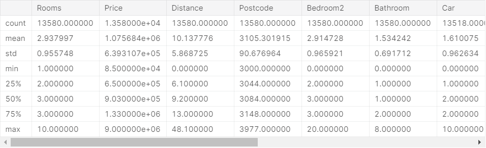

# Intro to Machine Learning

# 1. How Models Work

## 1.1 Introduction

Decision trees are easy to understand, and they are the basic building block for some of the best models in data science.

의사결정나무(Decision tree)


This step of capturing patterns from data is called **fitting** or **training** the model. The data used to **fit** the model is called the **training data**.

데이터로부터 패턴을 포착하는 이 단계를 fitting 또는 training the model 이라고 한다. 모델을 fit 하는데 사용되는 데이터를 training data라고 한다.


이해가 안가는 문장 : The details of how the model is fit (e.g. how to split up the data) is complex enough that we will save it for later.


## 1.2 Improving the Decision Tree


The biggest shortcoming of this model is that it doesn't capture most factors affecting home price, like number of bathrooms, lot size, location, etc.

You can capture more factors using a tree that has more "splits." These are called "deeper" trees.


The point at the bottom where we make a prediction is called a **leaf.**


# 2. Basic Data Exploration

## 2.1 Using Pandas to Get Familiar With Your Data

machine learning project

1. familiarize yourself with the data (Use the Pandas library)

   - Pandas is the primary tool data scientists use for exploring and manipulating data.

   - ```python
     import pandas as pd
     ```

   - The most important part of the Pandas library is the DataFrame.

   - ```python
     # save filepath to variable for easier access
     melbourne_file_path = '../input/melbourne-housing-snapshot/melb_data.csv'
     # read the data and store data in DataFrame titled melbourne_data
     melbourne_data = pd.read_csv(melbourne_file_path) 
     # print a summary of the data in Melbourne data
     melbourne_data.describe()
     ```

   - .csv = 엑셀 파일


## 2.2 Interpreting Data Description



이해가 안가는 문장 : The first number, the **count**, shows how many rows have non-missing values.

The second value is the mean, which is the average. Under that, std is the standard deviation, which measures how numerically spread out the values are. (mean : 평균, std : 표준편차)

To interpret the **min**, **25%**, **50%**, **75%** and **max** values, imagine sorting each column from lowest to highest value. The first (smallest) value is the min. If you go a quarter way through the list, you'll find a number that is bigger than 25% of the values and smaller than 75% of the values. That is the **25%** value (pronounced "25th percentile"). The 50th and 75th percentiles are defined analogously, and the **max** is the largest number.


## 2.3 Exercise: Explore Your Data

```python
# Set up code checking
from learntools.core import binder
binder.bind(globals())
from learntools.machine_learning.ex2 import *
print("Setup Complete")
```


### 2.3.1 Step 1: Loading Data

> Read the Iowa data file into a Pandas DataFrame called `home_data`.

```python
import pandas as pd

# Path of the file to read
iowa_file_path = '../input/home-data-for-ml-course/train.csv'

# Fill in the line below to read the file into a variable home_data
home_data = ____

# Call line below with no argument to check that you've loaded the data correctly
step_1.check()
```

```python
# Answer
home_data = pd.read_csv(iowa_file_path)
```


### 2.3.2 Step 2: Review The Data

> Use the command you learned to view summary statistics of the data. Then fill in variables to answer the following questions

```python
# Print summary statistics in next line
home_data.describe()
```

```python
# What is the average lot size (rounded to nearest integer)?
avg_lot_size = ____

# As of today, how old is the newest home (current year - the date in which it was built)
newest_home_age = ____

# Checks your answers
step_2.check()
```

```python
# Answer
avg_lot_size = 10517
newest_home_age = 10
```


### 2.3.3 Think About Your Data

The newest house in your data isn't that new. A few potential explanations for this:

1. They haven't built new houses where this data was collected.
2. The data was collected a long time ago. Houses built after the data publication wouldn't show up.

If the reason is explanation #1 above, does that affect your trust in the model you build with this data? What about if it is reason #2?

How could you dig into the data to see which explanation is more plausible?


# 3. Your First Machine Learning Model

## 3.1 Selecting Data for Modeling

We'll start by picking a few variables using our intuition. Later courses will show you statistical techniques to automatically prioritize variables.

To choose variables/columns, we'll need to see a list of all columns in the dataset. That is done with the columns property of the DataFrame (the bottom line of code below).

```python
import pandas as pd

melbourne_file_path = '../input/melbourne-housing-snapshot/melb_data.csv'
melbourne_data = pd.read_csv(melbourne_file_path) 
melbourne_data.columns
```

```
out:
Index(['Suburb', 'Address', 'Rooms', 'Type', 'Price', 'Method', 'SellerG',
       'Date', 'Distance', 'Postcode', 'Bedroom2', 'Bathroom', 'Car',
       'Landsize', 'BuildingArea', 'YearBuilt', 'CouncilArea', 'Lattitude',
       'Longtitude', 'Regionname', 'Propertycount'],
      dtype='object')
```

```python
# The Melbourne data has some missing values (some houses for which some variables weren't recorded.)
# We'll learn to handle missing values in a later tutorial.  
# Your Iowa data doesn't have missing values in the columns you use. 
# So we will take the simplest option for now, and drop houses from our data. 
# Don't worry about this much for now, though the code is:

# dropna drops missing values (think of na as "not available")
melbourne_data = melbourne_data.dropna(axis=0)
```


There are many ways to select a subset of your data. The [Pandas Micro-Course](https://www.kaggle.com/learn/pandas) covers these in more depth, but we will focus on two approaches for now.

1. Dot notation, which we use to select the "prediction target"
2. Selecting with a column list, which we use to select the "features"


### 3.1.1 Selecting The Prediction Target

You can pull out a variable with **dot-notation**. This single column is stored in a **Series**, which is broadly like a DataFrame with only a single column of data.

We'll use the dot notation to select the column we want to predict, which is called the **prediction target**. By convention, the prediction target is called **y**. So the code we need to save the house prices in the Melbourne data is

```python
y = melbourne_data.Price
```


## 3.2 Choosing "Features"

We select multiple features by providing a list of column names inside brackets. Each item in that list should be a string (with quotes).

Here is an example:

```python
melbourne_features = ['Rooms', 'Bathroom', 'Landsize', 'Lattitude', 'Longtitude']
```

By convention, this data is called **X**.

```python
X = melbourne_data[melbourne_features]
```

Let's quickly review the data we'll be using to predict house prices using the `describe` method and the `head` method, which shows the top few rows.

```python
X.describe()
```


```python
X.head()
```


Visually checking your data with these commands is an important part of a data scientist's job. You'll frequently find surprises in the dataset that deserve further inspection.


## 3.3 Building Your Model

You will use the **scikit-learn** library to create your models. When coding, this library is written as **sklearn**, as you will see in the sample code. Scikit-learn is easily the most popular library for modeling the types of data typically stored in DataFrames.

The steps to building and using a model are:

- **Define:** What type of model will it be? A decision tree? Some other type of model? Some other parameters of the model type are specified too.
- **Fit:** Capture patterns from provided data. This is the heart of modeling.
- **Predict:** Just what it sounds like
- **Evaluate**: Determine how accurate the model's predictions are.

Here is an example of defining a decision tree model with scikit-learn and fitting it with the features and target variable.

```python
from sklearn.tree import DecisionTreeRegressor

# Define model. Specify a number for random_state to ensure same results each run
melbourne_model = DecisionTreeRegressor(random_state=1)

# Fit model
melbourne_model.fit(X, y)
```

```
DecisionTreeRegressor(criterion='mse', max_depth=None, max_features=None,
                      max_leaf_nodes=None, min_impurity_decrease=0.0,
                      min_impurity_split=None, min_samples_leaf=1,
                      min_samples_split=2, min_weight_fraction_leaf=0.0,
                      presort=False, random_state=1, splitter='best')
```


이해가 안가는 문장 : Many machine learning models allow some randomness in model training. Specifying a number for random_state ensures you get the same results in each run. This is considered a good practice. You use any number, and model quality won't depend meaningfully on exactly what value you choose.


```python
print("Making predictions for the following 5 houses:")
print(X.head())
print("The predictions are")
print(melbourne_model.predict(X.head()))
```

```
Making predictions for the following 5 houses:
   Rooms  Bathroom  Landsize  Lattitude  Longtitude
1      2       1.0     156.0   -37.8079    144.9934
2      3       2.0     134.0   -37.8093    144.9944
4      4       1.0     120.0   -37.8072    144.9941
6      3       2.0     245.0   -37.8024    144.9993
7      2       1.0     256.0   -37.8060    144.9954
The predictions are
[1035000. 1465000. 1600000. 1876000. 1636000.]
```


## 3.4 Exercise: Your First MAchine Learning Model

### 3.4.1 Recap

>So far, you have loaded your data and reviewed it with the following code. Run this cell to set up your coding environment where the previous step left off.

```python
# Code you have previously used to load data
import pandas as pd

# Path of the file to read
iowa_file_path = '../input/home-data-for-ml-course/train.csv'

home_data = pd.read_csv(iowa_file_path)

# Set up code checking
from learntools.core import binder
binder.bind(globals())
from learntools.machine_learning.ex3 import *

print("Setup Complete")
```


### 3.4.2 Step 1: Specify Prediction Target

> Select the target variable, which corresponds to the sales price. Save this to a new variable called `y`. You'll need to print a list of the columns to find the name of the column you need.

```python
# print the list of columns in the dataset to find the name of the prediction target
home_data.columns
```

```
Index(['Id', 'MSSubClass', 'MSZoning', 'LotFrontage', 'LotArea', 'Street',
       'Alley', 'LotShape', 'LandContour', 'Utilities', 'LotConfig',
       'LandSlope', 'Neighborhood', 'Condition1', 'Condition2', 'BldgType',
       'HouseStyle', 'OverallQual', 'OverallCond', 'YearBuilt', 'YearRemodAdd',
       'RoofStyle', 'RoofMatl', 'Exterior1st', 'Exterior2nd', 'MasVnrType',
       'MasVnrArea', 'ExterQual', 'ExterCond', 'Foundation', 'BsmtQual',
       'BsmtCond', 'BsmtExposure', 'BsmtFinType1', 'BsmtFinSF1',
       'BsmtFinType2', 'BsmtFinSF2', 'BsmtUnfSF', 'TotalBsmtSF', 'Heating',
       'HeatingQC', 'CentralAir', 'Electrical', '1stFlrSF', '2ndFlrSF',
       'LowQualFinSF', 'GrLivArea', 'BsmtFullBath', 'BsmtHalfBath', 'FullBath',
       'HalfBath', 'BedroomAbvGr', 'KitchenAbvGr', 'KitchenQual',
       'TotRmsAbvGrd', 'Functional', 'Fireplaces', 'FireplaceQu', 'GarageType',
       'GarageYrBlt', 'GarageFinish', 'GarageCars', 'GarageArea', 'GarageQual',
       'GarageCond', 'PavedDrive', 'WoodDeckSF', 'OpenPorchSF',
       'EnclosedPorch', '3SsnPorch', 'ScreenPorch', 'PoolArea', 'PoolQC',
       'Fence', 'MiscFeature', 'MiscVal', 'MoSold', 'YrSold', 'SaleType',
       'SaleCondition', 'SalePrice'],
      dtype='object')
```

```python
# 가격은 SalePrice
y = home_data.SalePrice
```


### 3.4.3 Step 2: Create X

> Now you will create a DataFrame called `X` holding the predictive features.
>
> Since you want only some columns from the original data, you'll first create a list with the names of the columns you want in `X`.
>
> You'll use just the following columns in the list (you can copy and paste the whole list to save some typing, though you'll still need to add quotes):

```
* LotArea
* YearBuilt
* 1stFlrSF
* 2ndFlrSF
* FullBath
* BedroomAbvGr
* TotRmsAbvGrd
```

After you've created that list of features, use it to create the DataFrame that you'll use to fit the model.

```python
# Create the list of features below
feature_names = ['LotArea', 'YearBuilt', '1stFlrSF', '2ndFlrSF', 'FullBath', 'BedroomAbvGr', 'TotRmsAbvGrd']

# Select data corresponding to features in feature_names
X = home_data[feature_names]

# Check your answer
step_2.check()
```


#### Review Data

> Before building a model, take a quick look at **X** to verify it looks sensible

```python
# Review data
# print description or statistics from X
#print(X.describe())

# print the top few lines
#print(X.head())
```


### 3.4.4 Step 3: Specify and Fit Model

> Create a `DecisionTreeRegressor` and save it iowa_model. Ensure you've done the relevant import from sklearn to run this command.
>
> Then fit the model you just created using the data in `X` and `y` that you saved above.

```python
from sklearn.tree import DecisionTreeRegressor
#specify the model. 
#For model reproducibility, set a numeric value for random_state when specifying the model
iowa_model = DecisionTreeRegressor(random_state=1)

# Fit the model
iowa_model.fit(X, y)

# Check your answer
step_3.check()
```


### 3.4.5 Step 4: Make Predictions

> Make predictions with the model's `predict` command using `X` as the data. Save the results to a variable called `predictions`.

```python
predictions = iowa_model.predict(X)
print(predictions)
```


### 3.4.6 Think About Your Results

> Use the `head` method to compare the top few predictions to the actual home values (in `y`) for those same homes. Anything surprising?

```python
# You can write code in this cell
Z = home_data[['SalePrice']]
print(Z.head())
print(y.head())
print(iowa_model.predict(X.head()))
```

```
   SalePrice
0     208500
1     181500
2     223500
3     140000
4     250000
0    208500
1    181500
2    223500
3    140000
4    250000
Name: SalePrice, dtype: int64
[208500. 181500. 223500. 140000. 250000.]
```


# 4. Model Validation

## 4.1 What is Model Validation

Many people make a huge mistake when measuring predictive accuracy. They make predictions with their *training data* and compare those predictions to the target values in the *training data*.

If you compare predicted and actual home values for 10,000 houses, you'll likely find mix of good and bad predictions. Looking through a list of 10,000 predicted and actual values would be pointless. We need to summarize this into a single metric.

There are many metrics for summarizing model quality, but we'll start with one called **Mean Absolute Error** (also called **MAE**). Let's break down this metric starting with the last word, error.

The prediction error for each house is:

```
error=actual−predicted
```

With the MAE metric, we take the absolute value of each error. We then take the average of those absolute errors. In plain English, it can be said as

```
On average, our predictions are off by about X.
```

To calculate MAE, we first need a model. 

```python
# Data Loading Code Hidden Here
import pandas as pd

# Load data
melbourne_file_path = '../input/melbourne-housing-snapshot/melb_data.csv'
melbourne_data = pd.read_csv(melbourne_file_path) 
# Filter rows with missing price values
filtered_melbourne_data = melbourne_data.dropna(axis=0)
# Choose target and features
y = filtered_melbourne_data.Price
melbourne_features = ['Rooms', 'Bathroom', 'Landsize', 'BuildingArea', 
                        'YearBuilt', 'Lattitude', 'Longtitude']
X = filtered_melbourne_data[melbourne_features]

from sklearn.tree import DecisionTreeRegressor
# Define model
melbourne_model = DecisionTreeRegressor()
# Fit model
melbourne_model.fit(X, y)
```

의문 : 왜 이곳 DecisionTreeRegressor()에는 random_state=1 이 없을까?


Once we have a model, here is how we calculate the mean absolute error:

```python
from sklearn.metrics import mean_absolute_error

predicted_home_prices = melbourne_model.predict(X)
mean_absolute_error(y, predicted_home_prices)
```

```
434.71594577146544
```


## 4.2 The Problem with "In-Sample" Scores

The measure we just computed can be called an "in-sample" score. We used a single "sample" of houses for both building the model and evaluating it. Here's why this is bad.

Since this pattern was derived from the training data, the model will appear accurate in the training data.

Since models' practical value come from making predictions on new data, we measure performance on data that wasn't used to build the model. The most straightforward way to do this is to exclude some data from the model-building process, and then use those to test the model's accuracy on data it hasn't seen before. This data is called **validation data**.


### 4.2.1 Coding It

The scikit-learn library has a function `train_test_split` to break up the data into two pieces. We'll use some of that data as training data to fit the model, and we'll use the other data as validation data to calculate `mean_absolute_error`.

```python
from sklearn.model_selection import train_test_split

# split data into training and validation data, for both features and target
# The split is based on a random number generator. Supplying a numeric value to
# the random_state argument guarantees we get the same split every time we
# run this script.
train_X, val_X, train_y, val_y = train_test_split(X, y, random_state = 0)
# Define model
melbourne_model = DecisionTreeRegressor()
# Fit model
melbourne_model.fit(train_X, train_y)

# get predicted prices on validation data
val_predictions = melbourne_model.predict(val_X)
print(mean_absolute_error(val_y, val_predictions))
```

```
259556.7211103938
```


### 4.2.2 Wow!

Your mean absolute error for the in-sample data was about 500 dollars. Out-of-sample it is more than 250,000 dollars.

This is the difference between a model that is almost exactly right, and one that is unusable for most practical purposes. As a point of reference, the average home value in the validation data is 1.1 million dollars. So the error in new data is about a quarter of the average home value.

There are many ways to improve this model, such as experimenting to find better features or different model types.


## 4.3 Exercise: Model Validation

### 4.3.1 Recap

>  In this exercise you will test how good your model is.

```python
# Code you have previously used to load data
import pandas as pd
from sklearn.tree import DecisionTreeRegressor

# Path of the file to read
iowa_file_path = '../input/home-data-for-ml-course/train.csv'

home_data = pd.read_csv(iowa_file_path)
y = home_data.SalePrice
feature_columns = ['LotArea', 'YearBuilt', '1stFlrSF', '2ndFlrSF', 'FullBath', 'BedroomAbvGr', 'TotRmsAbvGrd']
X = home_data[feature_columns]

# Specify Model
iowa_model = DecisionTreeRegressor()
# Fit Model
iowa_model.fit(X, y)

print("First in-sample predictions:", iowa_model.predict(X.head()))
print("Actual target values for those homes:", y.head().tolist())

# Set up code checking
from learntools.core import binder
binder.bind(globals())
from learntools.machine_learning.ex4 import *
print("Setup Complete")
```


### 4.3.2 Step 1: Split Your Data

> Use the `train_test_split` function to split up your data.
>
> Give it the argument `random_state=1` so the `check` functions know what to expect when verifying your code.
>
> Recall, your features are loaded in the DataFrame **X** and your target is loaded in **y**.

```python
# Import the train_test_split function and uncomment
from sklearn.model_selection import train_test_split

# fill in and uncomment
train_X, val_X, train_y, val_y = train_test_split(X, y, random_state=1)
```


### 4.3.3 Step 2: Specify and Fit the Model

> Create a `DecisionTreeRegressor` model and fit it to the relevant data. Set `random_state` to 1 again when creating the model.

```python
# You imported DecisionTreeRegressor in your last exercise
# and that code has been copied to the setup code above. So, no need to
# import it again
from sklearn.tree import DecisionTreeRegressor

# Specify the model
iowa_model = DecisionTreeRegressor(random_state=1)

# Fit iowa_model with the training data.
iowa_model.fit(train_X, train_y)
```


### 4.3.4 Step 3: Make Predictions with Validation data

```python
# Predict with all validation observations
val_predictions = iowa_model.predict(val_X)
```

Inspect your predictions and actual values from validation data.

```python
# print the top few validation predictions
print(val_y)
# print the top few actual prices from validation data
print(val_predictions)
```


### 4.3.5 Step 4: Calculate the Mean Absolute Error in Validation Data

```python
from sklearn.metrics import mean_absolute_error
val_mae = mean_absolute_error(val_y, val_predictions)

# uncomment following line to see the validation_mae
print(val_mae)
```


# 5. Underfitting and Overfitting

## 5.1 Experimenting With Different Models

You can see in scikit-learn's [documentation](http://scikit-learn.org/stable/modules/generated/sklearn.tree.DecisionTreeRegressor.html) that the decision tree model has many options (more than you'll want or need for a long time). The most important options determine the tree's depth. Recall from [the first lesson in this micro-course](https://www.kaggle.com/dansbecker/how-models-work) that a tree's depth is a measure of how many splits it makes before coming to a prediction. This is a relatively shallow tree


If we keep doubling the number of groups by adding more splits at each level, we'll have 210210 groups of houses by the time we get to the 10th level. That's 1024 leaves.

This is a phenomenon called **overfitting**, where a model matches the training data almost perfectly, but does poorly in validation and other new data. On the flip side, if we make our tree very shallow, it doesn't divide up the houses into very distinct groups.

At an extreme, if a tree divides houses into only 2 or 4, each group still has a wide variety of houses. Resulting predictions may be far off for most houses, even in the training data (and it will be bad in validation too for the same reason). When a model fails to capture important distinctions and patterns in the data, so it performs poorly even in training data, that is called **underfitting**.

Since we care about accuracy on new data, which we estimate from our validation data, we want to find the sweet spot between underfitting and overfitting. Visually, we want the low point of the (red) validation curve in


## 5.1.1 Example

There are a few alternatives for controlling the tree depth, and many allow for some routes through the tree to have greater depth than other routes. But the *max_leaf_nodes* argument provides a very sensible way to control overfitting vs underfitting. The more leaves we allow the model to make, the more we move from the underfitting area in the above graph to the overfitting area.

We can use a utility function to help compare MAE scores from different values for *max_leaf_nodes*:

```python
from sklearn.metrics import mean_absolute_error
from sklearn.tree import DecisionTreeRegressor

def get_mae(max_leaf_nodes, train_X, val_X, train_y, val_y):
    model = DecisionTreeRegressor(max_leaf_nodes=max_leaf_nodes, random_state=0)
    model.fit(train_X, train_y)
    preds_val = model.predict(val_X)
    mae = mean_absolute_error(val_y, preds_val)
    return(mae)
```

The data is loaded into **train_X**, **val_X**, **train_y** and **val_y** using the code you've already seen (and which you've already written).

We can use a for-loop to compare the accuracy of models built with different values for *max_leaf_nodes.*

```python
# compare MAE with differing values of max_leaf_nodes
for max_leaf_nodes in [5, 50, 500, 5000]:
    my_mae = get_mae(max_leaf_nodes, train_X, val_X, train_y, val_y)
    print("Max leaf nodes: %d  \t\t Mean Absolute Error:  %d" %(max_leaf_nodes, my_mae))
```

```
Max leaf nodes: 5  		 Mean Absolute Error:  347380
Max leaf nodes: 50  		 Mean Absolute Error:  258171
Max leaf nodes: 500  		 Mean Absolute Error:  243495
Max leaf nodes: 5000  		 Mean Absolute Error:  254983
```

Of the options listed, 500 is the optimal number of leaves.


### 5.1.2 Conclusion

Here's the takeaway: Models can suffer from either:

- **Overfitting:** capturing spurious patterns that won't recur in the future, leading to less accurate predictions, or
- **Underfitting:** failing to capture relevant patterns, again leading to less accurate predictions.

We use **validation** data, which isn't used in model training, to measure a candidate model's accuracy. This lets us try many candidate models and keep the best one.


## 5.2 Exercise: Underfitting and Overfitting

### 5.2.1 Recap

> You've built your first model, and now it's time to optimize the size of the tree to make better predictions. Run this cell to set up your coding environment where the previous step left off.

```python
# Code you have previously used to load data
import pandas as pd
from sklearn.metrics import mean_absolute_error
from sklearn.model_selection import train_test_split
from sklearn.tree import DecisionTreeRegressor


# Path of the file to read
iowa_file_path = '../input/home-data-for-ml-course/train.csv'

home_data = pd.read_csv(iowa_file_path)
# Create target object and call it y
y = home_data.SalePrice
# Create X
features = ['LotArea', 'YearBuilt', '1stFlrSF', '2ndFlrSF', 'FullBath', 'BedroomAbvGr', 'TotRmsAbvGrd']
X = home_data[features]

# Split into validation and training data
train_X, val_X, train_y, val_y = train_test_split(X, y, random_state=1)

# Specify Model
iowa_model = DecisionTreeRegressor(random_state=1)
# Fit Model
iowa_model.fit(train_X, train_y)

# Make validation predictions and calculate mean absolute error
val_predictions = iowa_model.predict(val_X)
val_mae = mean_absolute_error(val_predictions, val_y)
print("Validation MAE: {:,.0f}".format(val_mae))

# Set up code checking
from learntools.core import binder
binder.bind(globals())
from learntools.machine_learning.ex5 import *
print("\nSetup complete")
```


You could write the function `get_mae` yourself. For now, we'll supply it. This is the same function you read about in the previous lesson. Just run the cell below.

```python
def get_mae(max_leaf_nodes, train_X, val_X, train_y, val_y):
    model = DecisionTreeRegressor(max_leaf_nodes=max_leaf_nodes, random_state=0)
    model.fit(train_X, train_y)
    preds_val = model.predict(val_X)
    mae = mean_absolute_error(val_y, preds_val)
    return(mae)
```


### 5.2.2 Step 1: Compare Different Tree Sizes

> Write a loop that tries the following values for *max_leaf_nodes* from a set of possible values.
>
> Call the *get_mae* function on each value of max_leaf_nodes. Store the output in some way that allows you to select the value of `max_leaf_nodes` that gives the most accurate model on your data.

```python
candidate_max_leaf_nodes = [5, 25, 50, 100, 250, 500]
# Write loop to find the ideal tree size from candidate_max_leaf_nodes
ans = 0
res_min = 10000000
for max_leaf_nodes in candidate_max_leaf_nodes:
    res = get_mae(max_leaf_nodes, train_X, val_X, train_y, val_y)
    print(res)
    if res_min > res:
        res_min = res
        ans = max_leaf_nodes

# Store the best value of max_leaf_nodes (it will be either 5, 25, 50, 100, 250 or 500)
best_tree_size = ans
```


### 5.2.3 Step 2: Fit Model Using All Data

> You know the best tree size. If you were going to deploy this model in practice, you would make it even more accurate by using all of the data and keeping that tree size. That is, you don't need to hold out the validation data now that you've made all your modeling decisions.

```python
# Fill in argument to make optimal size and uncomment
final_model = DecisionTreeRegressor(max_leaf_nodes=ans, random_state=0)

# fit the final model and uncomment the next two lines
final_model.fit(X, y)
```


# 6. Random Forests

## 6.1 Introduction

Today's most sophisticated modeling techniques face this tension between underfitting and overfitting. But, many models have clever ideas that can lead to better performance. We'll look at the **random forest** as an example.

### 6.1.1 Example

We build a random forest model similarly to how we built a decision tree in scikit-learn - this time using the `RandomForestRegressor` class instead of `DecisionTreeRegressor`.

```python
from sklearn.ensemble import RandomForestRegressor
from sklearn.metrics import mean_absolute_error

forest_model = RandomForestRegressor(random_state=1)
forest_model.fit(train_X, train_y)
melb_preds = forest_model.predict(val_X)
print(mean_absolute_error(val_y, melb_preds))
```

```
202888.18157951365
```


### 6.1.2 Conclusion

There is likely room for further improvement, but this is a big improvement over the best decision tree error of 250,000. There are parameters which allow you to change the performance of the Random Forest much as we changed the maximum depth of the single decision tree. But one of the best features of Random Forest models is that they generally work reasonably even without this tuning.


## 6.2 Exercise: Random Forests

### 6.2.1 Recap

```python
# Code you have previously used to load data
import pandas as pd
from sklearn.metrics import mean_absolute_error
from sklearn.model_selection import train_test_split
from sklearn.tree import DecisionTreeRegressor


# Path of the file to read
iowa_file_path = '../input/home-data-for-ml-course/train.csv'

home_data = pd.read_csv(iowa_file_path)
# Create target object and call it y
y = home_data.SalePrice
# Create X
features = ['LotArea', 'YearBuilt', '1stFlrSF', '2ndFlrSF', 'FullBath', 'BedroomAbvGr', 'TotRmsAbvGrd']
X = home_data[features]

# Split into validation and training data
train_X, val_X, train_y, val_y = train_test_split(X, y, random_state=1)

# Specify Model
iowa_model = DecisionTreeRegressor(random_state=1)
# Fit Model
iowa_model.fit(train_X, train_y)

# Make validation predictions and calculate mean absolute error
val_predictions = iowa_model.predict(val_X)
val_mae = mean_absolute_error(val_predictions, val_y)
print("Validation MAE when not specifying max_leaf_nodes: {:,.0f}".format(val_mae))

# Using best value for max_leaf_nodes
iowa_model = DecisionTreeRegressor(max_leaf_nodes=100, random_state=1)
iowa_model.fit(train_X, train_y)
val_predictions = iowa_model.predict(val_X)
val_mae = mean_absolute_error(val_predictions, val_y)
print("Validation MAE for best value of max_leaf_nodes: {:,.0f}".format(val_mae))


# Set up code checking
from learntools.core import binder
binder.bind(globals())
from learntools.machine_learning.ex6 import *
print("\nSetup complete")
```

> Data science isn't always this easy. But replacing the decision tree with a Random Forest is going to be an easy win.


### 6.2.2 Step 1: Use a Random Forest

```python
from sklearn.ensemble import RandomForestRegressor

# Define the model. Set random_state to 1
rf_model = RandomForestRegressor(random_state=1)

# fit your model
rf_model.fit(train_X, train_y)

# Calculate the mean absolute error of your Random Forest model on the validation data
rf_val_mae = mean_absolute_error(rf_model.predict(val_X), val_y)

print("Validation MAE for Random Forest Model: {}".format(rf_val_mae))
```


# 7. Exercise: Machine Learning Competitions

## 7.1 Introduction

Machine learning competitions are a great way to improve your data science skills and measure your progress.

In this exercise, you will create and submit predictions for a Kaggle competition. You can then improve your model (e.g. by adding features) to improve and see how you stack up to others taking this micro-course.

The steps in this notebook are:

1. Build a Random Forest model with all of your data (**X** and **y**)
2. Read in the "test" data, which doesn't include values for the target. Predict home values in the test data with your Random Forest model.
3. Submit those predictions to the competition and see your score.
4. Optionally, come back to see if you can improve your model by adding features or changing your model. Then you can resubmit to see how that stacks up on the competition leaderboard.


## 7.2 Recap

```python
# Code you have previously used to load data
import pandas as pd
from sklearn.ensemble import RandomForestRegressor
from sklearn.metrics import mean_absolute_error
from sklearn.model_selection import train_test_split
from sklearn.tree import DecisionTreeRegressor

# Set up code checking
import os
if not os.path.exists("../input/train.csv"):
    os.symlink("../input/home-data-for-ml-course/train.csv", "../input/train.csv")  
    os.symlink("../input/home-data-for-ml-course/test.csv", "../input/test.csv") 
from learntools.core import binder
binder.bind(globals())
from learntools.machine_learning.ex7 import *

# Path of the file to read. We changed the directory structure to simplify submitting to a competition
iowa_file_path = '../input/train.csv'

home_data = pd.read_csv(iowa_file_path)
# Create target object and call it y
y = home_data.SalePrice
# Create X
features = ['LotArea', 'YearBuilt', '1stFlrSF', '2ndFlrSF', 'FullBath', 'BedroomAbvGr', 'TotRmsAbvGrd']
X = home_data[features]

# Split into validation and training data
train_X, val_X, train_y, val_y = train_test_split(X, y, random_state=1)

# Specify Model
iowa_model = DecisionTreeRegressor(random_state=1)
# Fit Model
iowa_model.fit(train_X, train_y)

# Make validation predictions and calculate mean absolute error
val_predictions = iowa_model.predict(val_X)
val_mae = mean_absolute_error(val_predictions, val_y)
print("Validation MAE when not specifying max_leaf_nodes: {:,.0f}".format(val_mae))

# Using best value for max_leaf_nodes
iowa_model = DecisionTreeRegressor(max_leaf_nodes=100, random_state=1)
iowa_model.fit(train_X, train_y)
val_predictions = iowa_model.predict(val_X)
val_mae = mean_absolute_error(val_predictions, val_y)
print("Validation MAE for best value of max_leaf_nodes: {:,.0f}".format(val_mae))

# Define the model. Set random_state to 1
rf_model = RandomForestRegressor(random_state=1)
rf_model.fit(train_X, train_y)
rf_val_predictions = rf_model.predict(val_X)
rf_val_mae = mean_absolute_error(rf_val_predictions, val_y)

print("Validation MAE for Random Forest Model: {:,.0f}".format(rf_val_mae))
```


## 7.3 Creating a Model For the Competition

> Build a Random Forest model and train it on all of **X** and **y**.

```python
# To improve accuracy, create a new Random Forest model which you will train on all training data
rf_model_on_full_data = RandomForestRegressor()

# fit rf_model_on_full_data on all data from the training data
rf_model_on_full_data.fit(X, y)
```

의문 : 왜 RandomForestRegressor()에 random_state=1이 안들어갈까?


## 7.4 Make Predictions

> Read the file of "test" data. And apply your model to make predictions

```python
# path to file you will use for predictions
test_data_path = '../input/test.csv'

# read test data file using pandas
test_data = pd.read_csv(test_data_path)

# create test_X which comes from test_data but includes only the columns you used for prediction.
# The list of columns is stored in a variable called features
test_X = test_data[features]

# make predictions which we will submit. 
test_preds = rf_model_on_full_data.predict(test_X)

# The lines below shows how to save predictions in format used for competition scoring
# Just uncomment them.

output = pd.DataFrame({'Id': test_data.Id,
                      'SalePrice': test_preds})
output.to_csv('submission.csv', index=False)
```


## 7.5 Test Your Work

> To test your results, you'll need to join the competition (if you haven't already). So open a new window by clicking on [this link](https://www.kaggle.com/c/home-data-for-ml-course). Then click on the **Join Competition** button.

Next, follow the instructions below:

1. Begin by clicking on the blue **Save Version** button in the top right corner of this window. This will generate a pop-up window.
2. Ensure that the **Save and Run All** option is selected, and then click on the blue **Save** button.
3. This generates a window in the bottom left corner of the notebook. After it has finished running, click on the number to the right of the **Save Version** button. This pulls up a list of versions on the right of the screen. Click on the ellipsis **(...)** to the right of the most recent version, and select **Open in Viewer**. This brings you into view mode of the same page. You will need to scroll down to get back to these instructions.
4. Click on the **Output** tab on the right of the screen. Then, click on the **Submit to Competition** button to submit your results to the leaderboard.

You have now successfully submitted to the competition!

1. If you want to keep working to improve your performance, select the blue **Edit** button in the top right of the screen. Then you can change your model and repeat the process. There's a lot of room to improve your model, and you will climb up the leaderboard as you work.


## 7.6 Continuing Your Progress

There are many ways to improve your model, and **experimenting is a great way to learn at this point.**

The best way to improve your model is to add features. Look at the list of columns and think about what might affect home prices. Some features will cause errors because of issues like missing values or non-numeric data types.

The **[Intermediate Machine Learning](https://www.kaggle.com/learn/intermediate-machine-learning)** micro-course will teach you how to handle these types of features. You will also learn to use **xgboost**, a technique giving even better accuracy than Random Forest.


## 7.7 Other Micro-Courses

The **[Pandas](https://kaggle.com/Learn/Pandas)** micro-course will give you the data manipulation skills to quickly go from conceptual idea to implementation in your data science projects.

You are also ready for the **[Deep Learning](https://kaggle.com/Learn/Deep-Learning)** micro-course, where you will build models with better-than-human level performance at computer vision tasks.


# Intro to Machine Learning : Built-in Function 

```python
import pandas as pd

Name_file_path = '~~~.csv'
Name_data = pd.read_csr(Name_file_path)
Name_data.describe()
Name_data.columns
Name_data.Price
X.head()


from sklearn.tree import DecisionTreeRegressor

Name_model = DecisionTreeRegressor(random_state=1)
Name_model.fit(train_X, train_y)
Name_model.predict(val_X) # => val_y


from sklearn.metrics import mean_absolute_error

predicted_home_prices = melbourne_model.predict(X)
mean_absolute_error(y, predicted_home_prices)


from sklearn.model_selection import train_test_split

train_X, val_X, train_y, val_y = train_test_split(X, y, random_state = 0)
Name_model = DecisionTreeRegressor()
Name_model.fit(train_X, train_y)
val_predictions = melbourne_model.predict(val_X)
print(mean_absolute_error(val_y, val_predictions))
model = DecisionTreeRegressor(max_leaf_nodes=max_leaf_nodes, random_state=0)


from sklearn.ensemble import RandomForestRegressor

forest_model = RandomForestRegressor(random_state=1)
forest_model.fit(train_X, train_y)
melb_preds = forest_model.predict(val_X)
print(mean_absolute_error(val_y, melb_preds))
```

