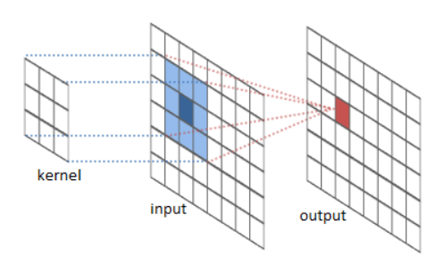
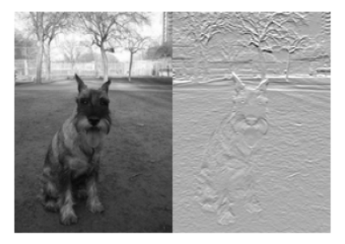
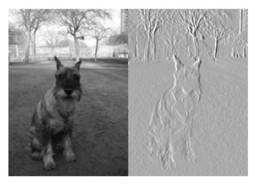

# Deep Learning

> Use TensorFlow to take machine learning to the next level. Your new skills will amaze you.


# 1. Intro to DL for Computer Vision

> A quick overview of how models work on images.

## 1.1 Intro to DL for ComputerVision

### 1.1.1 Intro

After the end of this lesson, you will understand convolutions. Convolutions are the basic building block for deep learning models in computer vision (and many other applications).

After that, we'll quickly progress to using world-class deep learning models.


### 1.1.2 Lesson

#### 1.1.2.1 Tensorflow & Keras

#### 둘은 무슨 사이인가?

Tensorflow: 구글에서 개발하고 오픈소스로 공개한 머신러닝 라이브러리. 깊은 학습을 위한 가장 인기있는 도구이다.

Keras: Tensorflow 위에서 동작하는 라이브러리. 딥러닝 모델을 정의하기 위한 인기있는 인터페이스 혹은 API 이다.


#### 왜 Tensorflow가 있는데 그 위에서 동작하는 Keras가 필요한가?

Tensorflow는 훌륭한 라이브러리이지만 아직 사용을 하기에는 어려운 부분이 많다. 특히 처음 머신러닝을 접하는 사람이라면 더욱 그렇다. 반면 Keras는 사용자 친화적으로 개발되었기 때문에 매우 사용이 편하다. 정말 간단한 신경망의 경우 겨우 몇 줄 만으로 만들 수 있다.


#### 그럼 Keras만 사용해도 충분한가?

비교적 단순한 신경망을 구성하거나 기존의 갖추어진 기능만을 사용한다면 Keras만으로 충분할 수 있다. 그러나 Tensorflow를 사용하는 쪽이 훨씬 더 디테일한 조작이 가능하다. 따라서 사용 목적에 따라서 어느 쪽을 사용할지 선택하는 것이 옳다.


#### 그럼 언제 Keras를 사용해야 하는가?

만약 처음 머신러닝을 시작하고 매우 간단한 것을 제작하거나 빠른 시간 내에 프로토타이핑을 하고자 한다면 Keras가 훨씬 좋은 선택일 수 있다.


#### 그렇다면 언제 Tensorflow를 사용해야 하는가?

만약 기존의 있던 기능만을 사용할 것이 아니라 새로운 방식을 이용할 가능성이 높다면 Tensorflow를 사용하는 것이 좋다. Tensorflow에서는 Threading이나 Queue 등의 매커니즘을 훨씬 디테일하게 사용할 수 있고 내부 구조를 확인할 수 있는 디버거를 사용할 수도 있다.


### 1.1.2.2 Convolution(합성곱) 이란?

**합성곱**(convolution, 콘벌루션)은 하나의 함수와 또 다른 함수를 반전 이동한 값을 곱한 다음, 구간에 대해 적분하여 새로운 함수를 구하는 수학 연산자이다.


## 1.2 Exercise: Intro to DL for Computer Vision

### 1.2.1 Intro

You don't directly choose the numbers to go into your convolutions for deep learning... instead the deep learning technique determines what convolutions will be useful from the data (as part of model-training). We'll come back to how the model does that soon.



But looking closely at convolutions and how they are applied to your image will improve your intuition for these models, how they work, and how to debug them when they don't work.


### 1.2.2 Exercises

We'll use some small utilty functions to visualize raw images and some results of your code. Execute the next cell to load the utility functions.

```python
# Set up code checking
from learntools.core import binder
binder.bind(globals())
from learntools.deep_learning.exercise_1 import *
```


#### 1.2.2.1 Exercise 1

In the video, you saw a convolution that detected horizontal lines. That convolution shows up again in the code cell below.

Run the cell to see a raw image as well as the output from applying this convolution to the image.

```python
horizontal_line_conv = [[1, 1], 
                        [-1, -1]]
# load_my_image and visualize_conv are utility functions provided for this exercise
original_image = load_my_image() 
visualize_conv(original_image, horizontal_line_conv)
```



Now it's your turn. Instead of a horizontal line detector, you will create a vertical line detector.

**Replace the underscores with numbers to make a vertical line detector and uncomment both lines of code in the cell below. Then run**


```python
vertical_line_conv = [[1, -1],
                     [1, -1]]

visualize_conv(original_image, vertical_line_conv)
```




#### 1.2.2.2 Exercise 2

The convolutions you've seen are 2x2. But you could have larger convolutions. They could be 3x3, 4x4, etc. They don't even have to be square. Nothing prevents using a 4x7 convolution.

Compare the number of visual patterns that can be captured by small convolutions. Which of the following is true?

- There are more visual patterns that can be captured by large convolutions
- There are fewer visual patterns that can be captured by large convolutions
- The number of visual patterns that can be captured by large convolutions is the same as the number of visual patterns that can be captured by small convolutions?


Solution: While any one convolution measures only a single pattern, there are more possible convolutions that can be created with large sizes. So there are also more patterns that can be captured with large convolutions.

For example, it's possible to create a 3x3 convolution that filters for bright pixels with a dark one in the middle. There is no configuration of a 2x2 convolution that would capture this.

On the other hand, anything that can be captured by a 2x2 convolution could also be captured by a 3x3 convolution.

Does this mean powerful models require extremely large convolutions? Not necessarily. In the next lesson, you will see how deep learning models put together many convolutions to capture complex patterns... including patterns to complex to be captured by any single convolution.


#### 정리

작은 합성곱으로 포착할 수 있는 패턴은 큰 합성곱으로 포착 가능하나 큰 합성곱으로 포착할 수 있는 패턴을 작은 합성곱은 포착할 수 없다. 그렇다면 무조건적으로 큰 합성콥이 유리한 것인가? 답은 그렇지 않다. 다음 수업에서 학습 모델들이 복잡한 패턴을 포착하기 위해 얼마나 많은 합성곱을 일으키는지 볼 수 있을 것이다. 복잡한 패턴을 포함시켜 단일 합성곱에 의해 포착할 수 있다.


# 2. Building Models From Convolutions

> Scale up from simple building blocks to models with beyond human capabilities.

## 2.1 Building Models From Convolutions

## 2.1.1 Intro

By the end of this lesson, you will understand how convolutions are combined to enable superhuman achievements in computer vision.


Now that you understand the structure of the models, learn how to build them with TensorFlow and Keras.


# 3. TensorFlow Programming

> Start writing code using TensorFlow and Keras


## 3.1 TensorFlow Programming

### 3.1.1 Intro

At the end of this lesson, you will be able to write TensorFlow and Keras code to use one of the best models in computer vision.


### 3.1.2 Lesson

1. 사진 속의 내용을 분류하기 위한 딥 러닝 모델
2. Keras의 사전 처리 기능 중 일부를 준비한다.
3. 이미지를 배열 함수로 생성하는 3차원 텐서에 이미지 저장


### 3.1.3 Sample Code

Choose Images to Work With

```python
from os.path import join

image_dir = '../input/dog-breed-identification/train/'
img_paths = [join(image_dir, filename) for filename in 
                           ['0c8fe33bd89646b678f6b2891df8a1c6.jpg',
                            '0c3b282ecbed1ca9eb17de4cb1b6e326.jpg',
                            '04fb4d719e9fe2b6ffe32d9ae7be8a22.jpg',
                            '0e79be614f12deb4f7cae18614b7391b.jpg']]
```


Function to Read and Prep Images for Modeling

```python
import numpy as np
from tensorflow.python.keras.applications.resnet50 import preprocess_input
from tensorflow.python.keras.preprocessing.image import load_img, img_to_array

image_size = 224

def read_and_prep_images(img_paths, img_height=image_size, img_width=image_size):
    imgs = [load_img(img_path, target_size=(img_height, img_width)) for img_path in img_paths]
    img_array = np.array([img_to_array(img) for img in imgs])
    output = preprocess_input(img_array)
    return(output)
```


Create Model with Pre-Trained Weights File. Make Predictions

```python
from tensorflow.python.keras.applications import ResNet50

my_model = ResNet50(weights='../input/resnet50/resnet50_weights_tf_dim_ordering_tf_kernels.h5')
test_data = read_and_prep_images(img_paths)
preds = my_model.predict(test_data)
```


Visualize Predictions

```python
from learntools.deep_learning.decode_predictions import decode_predictions
from IPython.display import Image, display

most_likely_labels = decode_predictions(preds, top=3, class_list_path='../input/resnet50/imagenet_class_index.json')

for i, img_path in enumerate(img_paths):
    display(Image(img_path))
    print(most_likely_labels[i])
```


## 3.2 Exercise: TensorFlow Programming

### 3.2.1 Intro

The TV show *Silicon Valley* had an app called "See Food" that promised to identify food.

In this notebook, you will write code using and comparing pre-trained models to choose one as an engine for the See Food app.

You won't go too deep into Keras or TensorFlow details in this particular exercise. Don't worry. You'll go deeper into model development soon. For now, you'll make sure you know how to use pre-trained models.


### 3.2.2 Set-Up

We will run a few steps of environmental set-up before writing your own code. **You don't need to understand the details of this set-up code.** You can just run each code cell until you get to the exercises.


#### 3.2.2.1 Create Image Paths

This workspace includes image files you will use to test your models. Run the cell below to store a few filepaths to these images in a variable `img_paths`.

```python
import os
from os.path import join


hot_dog_image_dir = '../input/hot-dog-not-hot-dog/seefood/train/hot_dog'

hot_dog_paths = [join(hot_dog_image_dir,filename) for filename in 
                            ['1000288.jpg',
                             '127117.jpg']]

not_hot_dog_image_dir = '../input/hot-dog-not-hot-dog/seefood/train/not_hot_dog'
not_hot_dog_paths = [join(not_hot_dog_image_dir, filename) for filename in
                            ['823536.jpg',
                             '99890.jpg']]

img_paths = hot_dog_paths + not_hot_dog_paths
```


#### 3.2.2.2 Run an Example Model

Here is the code you saw in the tutorial. It loads data, loads a pre-trained model, and makes predictions. Run this cell too.

```python
from IPython.display import Image, display
from learntools.deep_learning.decode_predictions import decode_predictions
import numpy as np
from tensorflow.keras.applications.resnet50 import preprocess_input
from tensorflow.keras.applications import ResNet50
from tensorflow.keras.preprocessing.image import load_img, img_to_array


image_size = 224

def read_and_prep_images(img_paths, img_height=image_size, img_width=image_size):
    imgs = [load_img(img_path, target_size=(img_height, img_width)) for img_path in img_paths]
    img_array = np.array([img_to_array(img) for img in imgs])
    output = preprocess_input(img_array)
    return(output)


my_model = ResNet50(weights='../input/resnet50/resnet50_weights_tf_dim_ordering_tf_kernels.h5')
test_data = read_and_prep_images(img_paths)
preds = my_model.predict(test_data)

most_likely_labels = decode_predictions(preds, top=3)
```


#### 3.2.2.3 Visualize Predictions

```python
for i, img_path in enumerate(img_paths):
    display(Image(img_path))
    print(most_likely_labels[i])
```


#### 3.2.2.4 Set Up Code Checking

As a last step before writing your own code, run the following cell to enable feedback on your code.

```python
# Set up code checking
from learntools.core import binder
binder.bind(globals())
from learntools.deep_learning.exercise_3 import *
print("Setup Complete")
```


### 3.2.3 Exercises

You will write a couple useful functions in the next exercises. Then you will put these functions together to compare the effectiveness of various pretrained models for your hot-dog detection program.


#### 3.2.3.1 Exercise 1

We want to distinguish whether an image is a hot dog or not. But our models classify pictures into 1000 different categories. Write a function that takes the models predictions (in the same format as `preds` from the set-up code) and returns a list of `True` and `False` values.

Some tips:

- Work iteratively. Figure out one line at a time outsie the function, and print that line's output to make sure it's right. Once you have all the code you need, move it into the function `is_hot_dog`. If you get an error, check that you have copied the right code and haven't left anything out.
- The raw data we loaded in `img_paths` had two images of hot dogs, followed by two images of other foods. So, if you run your function on `preds`, which represents the output of the model on these images, your function should return `[True, True, False, False]`.
- You will want to use the `decode_predictions` function that was also used in the code provided above. We provided a line with this in the code cell to get you started.


```python
# Experiment with code outside the function, then move it into the function once you think it is right

# the following lines are given as a hint to get you started
decoded = decode_predictions(preds, top=1)
print(decoded)

def is_hot_dog(preds):
    '''
    inputs:
    preds_array:  array of predictions from pre-trained model

    outputs:
    is_hot_dog_list: a list indicating which predictions show hotdog as the most likely label
    '''
    lst = []
    decoded = decode_predictions(preds, top=1)
    for data in decoded:
        if data[0][1] == 'hotdog':
            lst.append(True)
        else:
            lst.append(False)
    
    return lst
```

```
decoded
[[('n07697537', 'hotdog', 0.90688556)], [('n07697537', 'hotdog', 0.97324187)], [('n07579787', 'plate', 0.84794545)], [('n07583066', 'guacamole', 0.99991214)]]
```


#### 3.2.3.2 Exercise 2: Evaluate Model Accuracy

You have a model (called `my_model`). Is it good enough to build your app around?

Find out by writing a function that calculates a model's accuracy (fraction correct). You will try an alternative model in the next step. So we will put this logic in a reusable function that takes data and the model as arguments, and returns the accuracy.

Tips:

- Use the `is_hot_dog` function from above to help write your function
- To save you some scrolling, here is the code from above where we used a TensorFlow model to make predictions:

```python
my_model = ResNet50(weights='../input/resnet50/resnet50_weights_tf_dim_ordering_tf_kernels.h5')
test_data = read_and_prep_images(img_paths)
preds = my_model.predict(test_data)
```


```python
def calc_accuracy(model, paths_to_hotdog_images, paths_to_other_images):
    # We'll use the counts for denominator of accuracy calculation
    num_hot_dog_images = len(paths_to_hotdog_images)
    num_other_images = len(paths_to_other_images)

    hotdog_image_data = read_and_prep_images(paths_to_hotdog_images)
    preds_for_hotdogs = model.predict(hotdog_image_data)
    # Summing list of binary variables gives a count of True values
    num_correct_hotdog_preds = sum(is_hot_dog(preds_for_hotdogs))

    other_image_data = read_and_prep_images(paths_to_other_images)
    preds_other_images = model.predict(other_image_data)
    # Number correct is the number judged not to be hot dogs
    num_correct_other_preds = num_other_images - sum(is_hot_dog(preds_other_images))

    total_correct = num_correct_hotdog_preds + num_correct_other_preds
    total_preds = num_hot_dog_images + num_other_images
    return total_correct / total_preds
```


#### 3.2.3.3 Exercise 3:

There are other models besides the ResNet model (which we have loaded). For example, an earlier winner of the ImageNet competition is the VGG16 model. Don't worry about the differences between these models yet. We'll come back to that later. For now, just focus on the mechanics of applying these models to a problem.

The code used to load a pretrained ResNet50 model was

```
my_model = ResNet50(weights='../input/resnet50/resnet50_weights_tf_dim_ordering_tf_kernels.h5')
```

The weights for the model are stored at `../input/vgg16/vgg16_weights_tf_dim_ordering_tf_kernels.h5`.

In the cell below, create a VGG16 model with the preloaded weights. Then use your `calc_accuracy` function to determine what fraction of images the VGG16 model correctly classifies. Is it better or worse than the pretrained ResNet model?


```python
# import the model
from tensorflow.keras.applications import VGG16


vgg16_model = VGG16(weights='../input/vgg16/vgg16_weights_tf_dim_ordering_tf_kernels.h5')
# calculate accuracy on small dataset as a test
vgg16_accuracy = calc_accuracy(vgg16_model, hot_dog_paths, not_hot_dog_paths)

print("Fraction correct in small dataset: {}".format(vgg16_accuracy))
```

If this model is used for an app that runs on a phone, what factors besides accuracy might you care about? After you've thought about it, keep going below.


# Deep Learning: Built-in Function

```python
from learntools.core import binder
binder.bind(globals())
from learntools.deep_learning.exercise_1 import *

vertical_line_conv = [[1, -1],
                     [1, -1]]
visualize_conv(original_image, vertical_line_conv)

vertical_line_conv = [[1, -1],
                     [1, -1]]
visualize_conv(original_image, vertical_line_conv)
```

