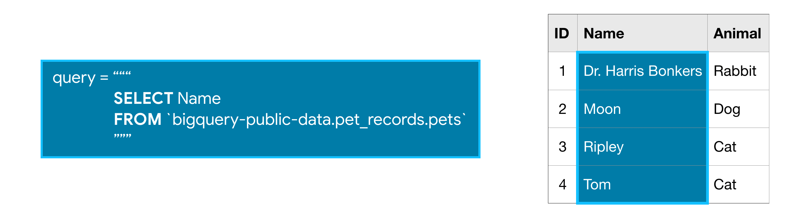

# Intro to SQL

# 1. Getting Started With SQL and BigQuery

## 1.1 Tutorial

### 1.1.1 Introduction

Structured Query Language, or **SQL**, is the programming language used with databases, and it is an important skill for any data scientist. In this course, you'll build your SQL skills using **BigQuery**, a web service that lets you apply SQL to huge datasets.


### 1.1.2 Your first BigQuery commands

To use BigQuery, we'll import the Python package below:

```python
from google.cloud import bigquery
```


The first step in the workflow is to create a [`Client`](https://google-cloud.readthedocs.io/en/latest/bigquery/generated/google.cloud.bigquery.client.Client.html#google.cloud.bigquery.client.Client) object. As you'll soon see, this `Client` object will play a central role in retrieving information from BigQuery datasets.

```python
# Create a "Client" object
client = bigquery.Client()
```

```
Using Kaggle's public dataset BigQuery integration.
```


We'll work with a dataset of posts on [Hacker News](https://news.ycombinator.com/), a website focusing on computer science and cybersecurity news.

In BigQuery, each dataset is contained in a corresponding project. In this case, our `hacker_news` dataset is contained in the `bigquery-public-data` project. To access the dataset,

- We begin by constructing a reference to the dataset with the [`dataset()`](https://google-cloud.readthedocs.io/en/latest/bigquery/generated/google.cloud.bigquery.client.Client.dataset.html#google.cloud.bigquery.client.Client.dataset) method.
- Next, we use the [`get_dataset()`](https://google-cloud.readthedocs.io/en/latest/bigquery/generated/google.cloud.bigquery.client.Client.get_dataset.html#google.cloud.bigquery.client.Client.get_dataset) method, along with the reference we just constructed, to fetch the dataset.

```python
# Construct a reference to the "hacker_news" dataset
dataset_ref = client.dataset("hacker_news", project="bigquery-public-data")

# API request - fetch the dataset
dataset = client.get_dataset(dataset_ref)
```


Every dataset is just a collection of tables. You can think of a dataset as a spreadsheet file containing multiple tables, all composed of rows and columns.

We use the `list_tables()` method to list the tables in the dataset.

```python
# List all the tables in the "hacker_news" dataset
tables = list(client.list_tables(dataset))

# Print names of all tables in the dataset (there are four!)
for table in tables:  
    print(table.table_id)
```

```
comments
full
full_201510
stories
```


Similar to how we fetched a dataset, we can fetch a table. In the code cell below, we fetch the `full` table in the `hacker_news` dataset.

```python
# Construct a reference to the "full" table
table_ref = dataset_ref.table("full")

# API request - fetch the table
table = client.get_table(table_ref)
```


In the next section, you'll explore the contents of this table in more detail. For now, take the time to use the image below to consolidate what you've learned so far.


### 1.1.3 Table schema

The structure of a table is called its **schema**. We need to understand a table's schema to effectively pull out the data we want.

In this example, we'll investigate the `full` table that we fetched above.

```python
# Print information on all the columns in the "full" table in the "hacker_news" dataset
table.schema
```

<details><summary>table.schema</summary>[SchemaField('title', 'STRING', 'NULLABLE', 'Story title', ()),
 SchemaField('url', 'STRING', 'NULLABLE', 'Story url', ()),
 SchemaField('text', 'STRING', 'NULLABLE', 'Story or comment text', ()),
 SchemaField('dead', 'BOOLEAN', 'NULLABLE', 'Is dead?', ()),
 SchemaField('by', 'STRING', 'NULLABLE', "The username of the item's author.", ()),
 SchemaField('score', 'INTEGER', 'NULLABLE', 'Story score', ()),
 SchemaField('time', 'INTEGER', 'NULLABLE', 'Unix time', ()),
 SchemaField('timestamp', 'TIMESTAMP', 'NULLABLE', 'Timestamp for the unix time', ()),
 SchemaField('type', 'STRING', 'NULLABLE', 'Type of details (comment, comment_ranking, poll, story, job, pollopt)', ()),
 SchemaField('id', 'INTEGER', 'NULLABLE', "The item's unique id.", ()),
 SchemaField('parent', 'INTEGER', 'NULLABLE', 'Parent comment ID', ()),
 SchemaField('descendants', 'INTEGER', 'NULLABLE', 'Number of story or poll descendants', ()),
 SchemaField('ranking', 'INTEGER', 'NULLABLE', 'Comment ranking', ()),
 SchemaField('deleted', 'BOOLEAN', 'NULLABLE', 'Is deleted?', ())]</details>


Each [`SchemaField`](https://googleapis.github.io/google-cloud-python/latest/bigquery/generated/google.cloud.bigquery.schema.SchemaField.html#google.cloud.bigquery.schema.SchemaField) tells us about a specific column (which we also refer to as a **field**). In order, the information is:

- The **name** of the column
- The **field type** (or datatype) in the column
- The **mode** of the column (`'NULLABLE'` means that a column allows NULL values, and is the default)
- A **description** of the data in that column

The first field has the SchemaField:

```
SchemaField('by', 'string', 'NULLABLE', "The username of the item's author.",())
```

This tells us:

- the field (or column) is called `by`,
- the data in this field is strings,
- NULL values are allowed, and
- it contains the usernames corresponding to each item's author.

We can use the [`list_rows()`](https://google-cloud.readthedocs.io/en/latest/bigquery/generated/google.cloud.bigquery.client.Client.list_rows.html#google.cloud.bigquery.client.Client.list_rows) method to check just the first five lines of of the `full` table to make sure this is right. (Sometimes databases have outdated descriptions, so it's good to check.) This returns a BigQuery [`RowIterator`](https://googleapis.github.io/google-cloud-python/latest/bigquery/generated/google.cloud.bigquery.table.RowIterator.html) object that can quickly be converted to a pandas DataFrame with the [`to_dataframe()`](https://google-cloud.readthedocs.io/en/latest/bigquery/generated/google.cloud.bigquery.table.RowIterator.to_dataframe.html) method.

```python
# Preview the first five lines of the "full" table
client.list_rows(table, max_results=5).to_dataframe()
```


The `list_rows()` method will also let us look at just the information in a specific column. If we want to see the first five entries in the `by` column, for example, we can do that!

```python
# Preview the first five entries in the "by" column of the "full" table
client.list_rows(table, selected_fields=table.schema[:1], max_results=5).to_dataframe()
```


### 1.1.4 Disclaimer

Before we go into the coding exercise, a quick disclaimer for those who already know some SQL:

**Each Kaggle user can scan 5TB every 30 days for free. Once you hit that limit, you'll have to wait for it to reset.**

The commands you've seen so far won't demand a meaningful fraction of that limit. But some BiqQuery datasets are huge. So, if you already know SQL, wait to run SELECT queries until you've seen how to use your allotment effectively. If you are like most people reading this, you don't know how to write these queries yet, so you don't need to worry about this disclaimer.


## 1.2 Exercise

### 1.2.1 Introduction

```python
# Set up feedack system
from learntools.core import binder
binder.bind(globals())
from learntools.sql.ex1 import *
print("Setup Complete")
```

```
Using Kaggle's public dataset BigQuery integration.
Setup Complete
```


```python
from google.cloud import bigquery

# Create a "Client" object
client = bigquery.Client()

# Construct a reference to the "chicago_crime" dataset
dataset_ref = client.dataset("chicago_crime", project="bigquery-public-data")

# API request - fetch the dataset
dataset = client.get_dataset(dataset_ref)
```


### 1.2.2 1) Count tables in the dataset

> How many tables are in the Chicago Crime dataset?

```python
# Write the code you need here to figure out the answer
```


```python
num_tables = tables = len(list(client.list_tables(dataset)))  # Store the answer as num_tables and then run this cell
```


### 1.2.3 2) Explore the table schema

> How many columns in the `crime` table have `TIMESTAMP` data?

```python
table_ref = dataset_ref.table("crime")
table = client.get_table(table_ref)
print(table.schema)
num_timestamp_fields = 2 # Put your answer here
```


### 1.2.4 3) Create a crime map

> If you wanted to create a map with a dot at the location of each crime, what are the names of the two fields you likely need to pull out of the `crime` table to plot the crimes on a map?

```python
fields_for_plotting = ['latitude', 'longitude'] # Put your answers here
```

???????


# 2. Select, From & Where

## 2.1 Tutorial

### 2.1.1 Introduction

We'll begin by using the keywords **SELECT**, **FROM**, and **WHERE** to get data from specific columns based on conditions you specify.

For clarity, we'll work with a small imaginary dataset `pet_records` which contains just one table, called `pets`.


### 2.1.2 SELECT ... FROM

The most basic SQL query selects a single column from a single table. To do this,

- specify the column you want after the word **SELECT**, and then
- specify the table after the word **FROM**.

For instance, to select the `Name` column (from the `pets` table in the `pet_records` database in the `bigquery-public-data` project), our query would appear as follows:



Note that when writing an SQL query, the argument we pass to **FROM** is *not* in single or double quotation marks (' or "). It is in backticks (`).


### 2.1.3 WHERE ...

BigQuery datasets are large, so you'll usually want to return only the rows meeting specific conditions. You can do this using the **WHERE** clause.

The query below returns the entries from the `Name` column that are in rows where the `Animal` column has the text `'Cat'`.


### 2.1.4 Example: What are all the U.S. cities in the OpenAQ dataset?


# Intro to SQL : Built-in Function

```python
from google.cloud import bigquery

client = bigquery.Client()
dataset_ref = client.dataset("hacker_news", project="bigquery-public-data")
dataset = client.get_dataset(dataset_ref)
tables = list(client.list_tables(dataset))
for table in tables:  
    print(table.table_id)

table_ref = dataset_ref.table("full")
table = client.get_table(table_ref)
table.schema
client.list_rows(table, max_results=5).to_dataframe()
client.list_rows(table, stelected_fields=table.schema[:1], max_results=5).to_dataframe()

fields_for_plotting = ['latitude', 'longitude']
```

