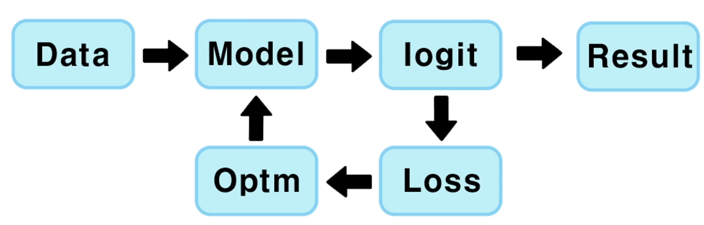

# 1. 인공지능 개념이해

## 1.1. 챕터 소개

### 1.1.1. 목차

- 코드와 시각적으로 딥러닝 이해
- 깊게 들어가는 이론은 없으니 먼저 쭉 따라 해보시다가 이론 공부 하신 후에 다시 한번 더 보시는 걸 권장
- 일단 기본 CNN과 간단한 프로젝트도 돌릴 수 있을 정도의 수준

### 1.1.2. 강의 구성

- CNN을 이해하기 위한 전체적인 큰 그림
  - CNN을 이해하기 위해 알아야 할 것
- CNN을 짜기 위한 준비
  - Anaconda 설치부터 여는 방법
  - Numpy부터 Matplotlib 기초

## 1.2. 전체 구조 및 학습과정

### 1.2.1. 전체적인 그림

1. 데이터가 들어감
2. 모델이란 것(Resnet 등)이 학습
3. 정답(레이블)과 비교하여 최적화
4. 다시 모델이 적용

### 1.2.2. Data

- 학습  시키기 위한 데이터. 이 데이터가 모델에 들어감
- 데이터가 생성되고, 데이터에 Transform 변형을 준다거나 모델에 들어가기 전에 데이터 전처리가 들어감
- 이 때 들어갈 때는 Batch로 만들어서 Model에 넣어줌

### 1.2.3. Model

- LeNet, AlexNet, VGG나 ResNet 등 다양하게 설계된 모델
- Convolution Layer, Pooling 등 다양한 Layer 층들로 구성
- 이 모델 안에 학습 파라미터가 있고, 이 모델이 학습하는 대상

### 1.2.4. Prediction / Logit

[0.15, 0.3, 0.2, 0.25, 0.1]

- 각 Class별로 예측한 값.
- 여기서 가장 높은 값이 모델이 예상하는 class 또는 정답

[0.0, 0.0, 0.0, 1.0, 0.0]

- 위의 숫자가 정답이라고 할 때 얼마나 틀렸는지 얼마나 맞았는지 확인 가능

### 1.2.5. Loss / Cost

- 예측한 값과 정답과 비교해서 얼마나 틀렸는지를 확인.
- Cross Entropy 등 다양한 Loss Function들이 있음
- 이 때 계산을 통해 나오는 값이 Loss(Cost, Cost Value 등)이라고 불림
- 이 Loss는 "얼마나 틀렸는지"를 말하며 이 값을 최대한 줄이는 것이 학습의 과정

### 1.2.6. Optimization

- 앞에서 얻은 Loss 값을 최소화하기 위해 기울기를 받아 최적화된 Variable 값들로 반환
- 이 반환된 값이 적용된 모델은 바로 전에 돌렸을 때의 결과보다 더 나아지게 됨
- 이 때 바로 최적화된 값만큼 바로 움직이는 것이 아닌 Learning Rate만큼 움직인 값이 적용

### 1.2.7. Result

- 평가 할 때 또는 예측된 결과를 확인 할 때는 예측된 값에서 argmax를 통해 가장 높은 값을 예측한 class라고 둠

[0.15, 0.3, 0.2, 0.25, 0.1]

위의 예측값에서는 0.2가 제일 높은 값이므로 클래스 2가 가장 높다고 봄 (파이썬에선 0으로 시작)

> 0.3이 제일 높지 않나??

## 1.3. 딥러닝 용어 - 1

## 1.4. 딥러닝 용어 - 2

## 1.5. CNN 모델 구조

