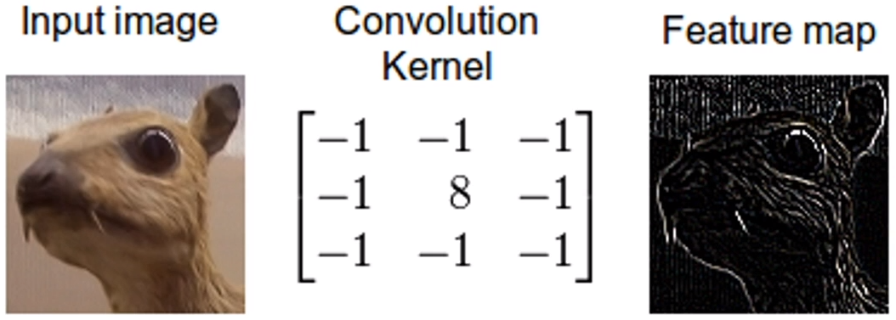

# 1. 인공지능 개념이해 - 챕터 소개

## 1.1. 목차

- 코드와 시각적으로 딥러닝 이해
- 깊게 들어가는 이론은 없으니 먼저 쭉 따라 해보시다가 이론 공부 하신 후에 다시 한번 더 보시는 걸 권장
- 일단 기본 CNN과 간단한 프로젝트도 돌릴 수 있을 정도의 수준


## 1.2. 강의 구성

- CNN을 이해하기 위한 전체적인 큰 그림
  - CNN을 이해하기 위해 알아야 할 것
- CNN을 짜기 위한 준비
  - Anaconda 설치부터 여는 방법
  - Numpy부터 Matplotlib 기초


# 2. 인공지능 개념이해 - 전체 구조 및 학습과정

## 2.1. 전체적인 그림


1. 데이터가 들어감
2. 모델이란 것(Resnet 등)이 학습
3. 정답(레이블)과 비교하여 최적화
4. 다시 모델이 적용


## 2.2. Data

- 학습  시키기 위한 데이터. 이 데이터가 모델에 들어감
- 데이터가 생성되고, 데이터에 Transform 변형을 준다거나 모델에 들어가기 전에 데이터 전처리가 들어감
- 이 때 들어갈 때는 Batch로 만들어서 Model에 넣어줌


## 2.3. Model

- LeNet, AlexNet, VGG나 ResNet 등 다양하게 설계된 모델
- Convolution Layer, Pooling 등 다양한 Layer 층들로 구성
- 이 모델 안에 학습 파라미터가 있고, 이 모델이 학습하는 대상


## 2.4. Prediction / Logit

[0.15, 0.3, 0.2, 0.25, 0.1]

- 각 Class별로 예측한 값.
- 여기서 가장 높은 값이 모델이 예상하는 class 또는 정답

[0.0, 0.0, 0.0, 1.0, 0.0]

- 위의 숫자가 정답이라고 할 때 얼마나 틀렸는지 얼마나 맞았는지 확인 가능


## 2.5. Loss / Cost

- 예측한 값과 정답과 비교해서 얼마나 틀렸는지를 확인.
- Cross Entropy 등 다양한 Loss Function들이 있음
- 이 때 계산을 통해 나오는 값이 Loss(Cost, Cost Value 등)이라고 불림
- 이 Loss는 "얼마나 틀렸는지"를 말하며 이 값을 최대한 줄이는 것이 학습의 과정


## 2.6. Optimization

- 앞에서 얻은 Loss 값을 최소화하기 위해 기울기를 받아 최적화된 Variable 값들로 반환
- 이 반환된 값이 적용된 모델은 바로 전에 돌렸을 때의 결과보다 더 나아지게 됨
- 이 때 바로 최적화된 값만큼 바로 움직이는 것이 아닌 Learning Rate만큼 움직인 값이 적용


## 2.7. Result

- 평가 할 때 또는 예측된 결과를 확인 할 때는 예측된 값에서 argmax를 통해 가장 높은 값을 예측한 class라고 둠

[0.15, 0.3, 0.2, 0.25, 0.1]

위의 예측값에서는 0.2가 제일 높은 값이므로 클래스 2가 가장 높다고 봄 (파이썬에선 0으로 시작)

> 0.3이 제일 높지 않나??


# 3. 인공지능 개념이해 - 딥러닝 용어(1)

## 3.1. Model


model을 학습시키기 위한 것.


## 3.2. Layer


여러 층을 쌓았다하여 딥러닝.

> 층이 깊을수록 좋다고는 하나 너무 깊으면 overfitting되기 쉬우며 성능적으로 무겁고 느릴 수 있다.
>
> 깊이 쌓아여 feature를 detail하게 얻을 수 있다.


## 3.3. Convolution (합성곱)



위의 합성곱은 테두리를 잡아주는 필터


## 3.4. Weight / Filter / Kernel / Variable / Bias

- Weight ~ Variable (깊이 들어가면 다른 용어이나 일단 묶어서 생각)
  - 학습하고자 하는 대상
  - Convolution 안의 weight를 학습시킨다.
- Bias
  - y = Wx + b (=> bias)


## 3.5. Pooling Layer


> 뽑아낸 feature들을 Pooling Layer가 압축시켜준다.
>
> 이미지가 가진 가장 큰 특징들을 반으로 줄여준다.


## 3.6. Optimization


## 3.7. Activation Function (활성화 함수)


> 앞에서 뽑은 특징에서 음수와 같은 불필요한 부분을 제거한다. (ReLU)


## 3.8. Softmax


> 가중치
>
> Softmax를 거쳐서 합이 1이 되도록 한다.


# 4. 인공지능 개념이해 - 딥러닝 용어(2)

## 4.1. Cost / Loss / Loss Function


Loss Function : 예측치가 얼마나 틀렸는가를 계산하는 방식


## 4.2. Optimization


> Loss Function으로 계산된 값을 줄이기 위한 행위 (최적화)
>
> 모델을 업데이트 한다.


## 4.3. Learning Rate


> Learning Rate가 너무 낮으면 시간이 오래 걸린다.
>
> Learning Rate가 너무 높으면 minimum point를 찾지 못할수도 있다.


## 4.4. Batch Size

> 모델에 데이터를 넣어주는데 데이터를 한번에 넣어줄 수 없다.
>
> 한번에 몇 개의 데이터를 넣어줄 것인가가 바로 Batch Size. 보통 32, 64, 128...


## 4.5. Epoch / Step

> Epoch : 모델에 같은 데이터를 몇 번 반복하여 학습시킬 것인가.


## 4.6. Train / Validation / Test


## 4.7. Label / Ground Truth


> 정답. 즉, Y에 해당하는 것.


# 5. 인공지능 개념이해 - CNN 모델 구조

## 5.1. Feature Extraction / Classification


> 특징을 추출하는 곳 / 결정을 내리는 곳
>
> 딥러닝이 어떠한 특징들을 뽑아냈는지 이야기하기 어렵다 => 때문에 블랙박스라고 불림


## 5.2. Convolution Layer


> Filter에 따라 가져오는 특징이 다르다.


## 5.3. Pooling Layer (Max Pooling)


> 가장 큰 특징만을 모은다. 압축이라고 이해하면 좋다.


## 5.4. Fully Connected


> 예측하는 부분


## 5.5. Model

> Layer층에 대해 어떤 Layer층이 있을까에 대해 두려워할 필요가 없다.

### 5.5.1. LeNet


### 5.5.2. AlexNet


### 5.5.3. VGG-16


### 5.5.4. ResNet


### 5.5.5. DenseNet


# 6. 인공지능 개발준비 - OS별 Anaconda부터 TensorFlow 및 Pytorch 설치 (Windows)

## 6.1. anaconda 설치

1. 구글에 anaconda download 검색 후, 첫 번째 사이트 접속.

2. 가장 하단에 있는 다운로드 중 파이썬 3.7 버전에 호환되는 다운로드 선택

3. Username이 한국말로 되있는 경우 All users 선택

   

4. 꼭 체크해야 하는 것은 아니지만 path 설정을 해주기 위해 위쪽 체크 선택

   

5. 작업하고자 하는 Workspace를 만들어준 후, `shift+오른쪽 마우스` 를 통해서 PowerShell을 열어 jupyter notebook을 켤 수 있다.


## 6.2. tensorflow 설치

1. (바로 3번으로 넘어가도 됨)https://www.tensorflow.org/ tps://www.tensorflow.org/ 에 접속
2. 설치로 들어가서 설치 코드를 확인
3. power shell을 열어 `$ pip install tensorflow` 를 입력해준다. 만약 pip 버전이 낮다면 `$ pip install --upgrade pip` 를 먼저 입력해준다.
4. anaconda(jupyter notebook)에서 `import tensorflow as tf` 코드를 통해 사용이 가능하다


## 6.3. pytorch 설치

1. https://pytorch.org/ 에 접속

2. 하단에 설치하고자 하는 환경에 대한 설치 코드를 알아낼 수 있다.

   

   ```
   pip install torch==1.5.1+cpu torchvision==0.6.1+cpu -f https://download.pytorch.org/whl/torch_stable.html
   ```

3. power shell에 코드를 입력하여 설치
4. `import torch` 코드를 통해서 사용이 가능하다.


# 7. 인공지능 개발준비 - OS별 Anaconda부터 TensorFlow 및 Pytorch 설치 (mac)

생략


# 8. 인공지능 개발준비 - Anaconda 활용 및 단축키

- `Shift+Enter` : 코드블럭 실행 후, 다음 셀로 넘어감.
- `Alt+Enter` : 실행하고 다음셀 생성 후, 새로 생성된 셀로 넘어감.
- `Ctrl+Enter`: 실행한 후, 실행한 셀에 남음.

코드 블럭의 왼편이 파란색일 때는 Command Mode, 초록색일 때는 Edit Mode 이다. Esc를 누르면 Command Mode로, Enter를 누르면 Edit Mode로 전환할 수 있다.


- `dd` : 셀 삭제, 셀 다중선택 후 사용하면 여러 개의 셀을 한번에 삭제 가능.
- `Shift+M` : 셀 병합.
- `Shift+Ctrl+-` : 셀 분할.
- Kernel - Restart : 코드 재실행.
- `a` : 위쪽에 새로운 셀 생성.
- `b` : 아래쪽에 새로운 셀 생성.
- `m` : 코드블럭 markdown 모드로 변경.

Help - Keyboard Shortcuts 에서 단축키 확인 가능.


# 9. 인공지능 개발준비 - Tensor 이해하기

## 9.1. Tensor


딥러닝에서는 주로 고차원적인 데이터를 많이 사용될 것이기 때문에 Tensor의 개념을 잘 이해하는 것이 중요하다.

Numpy는 그런 고차원적인 데이터를 다루기 쉽게 만들어져 있어 딥러닝을 하게 된다면 늘 접하게 될 것이다.

```python
import numpy as np
```


### 9.1.1. 0차원

- numpy array는 1 또는 5, 10와 같이 숫자 데이터를 arra화 해줄 수 있다.
- Scalar로 들어갔을 때는 shape가 아무것도 없는 것으로 나온다.

```python
arr = np.array(5)
print(arr.shape)
print(arr.ndim)
```

```
()
0
```


### 9.1.2. 1차원

- 숫자가 10과 같이 하나만 들어간다고 해도 [] 리스트를 한번 씌우게 되면 차원이 생긴다.
- 이때는 1차원이 되는건데 numpy 에서 shape를 표현할 때 (1)이 아닌 (1, ) 이런 식으로 표현하게 된다.

```python
arr = np.array([5])
print(arr.shape)
```

```
(1, )
```

- 명심해야 할 것이 있는데 위의 (3, )에서 3은 3이라는 값이 들어간 것이 아닌 shape라는 것이다.
- 1차원에서 3개의 값이 들어갔다는 의미
- 해석하자면 1차원에 3개의 값(value)가 들어가 있는 상태

```python
arr = np.array([1, 2, 3])
print(arr.shape)
```

```
(3, )
```


### 9.1.3. 2차원

- 대괄호를 추가적으로 씌우면 차원이 추가적으로 하나 생김

```python
arr = np.array([[1, 2, 3]])
print(arr.shape)
```

```
(1, 3)
```

- 위의 shape를 다시 보자면 차원이 2개가 있고, 각 차원마다 각각 3개의 값이 들어있다고 생각하면 된다.

```python
arr = np.array([[1, 2, 3], [1, 2, 3], [1, 2, 3]])
print(arr.shape)
```

```
(3, 3)
```

- 참고로 0차원 숫자에 대문자에 대괄호를 2번 씌우면 두 개의 차원이 된다.

```python
arr = np.array([[10]])
print(arr.shape)
print(arr.ndim)
```

```
(1, 1)
2
```


### 9.1.4. 다 차원


```python
print(arr.shape)
```

```
(2, 2, 3, 3)
```


```python
print(arr.shape)
```

```
(3, 3, 1)
```


# 10. 인공지능 개발준비 - Numpy 기초(1)


