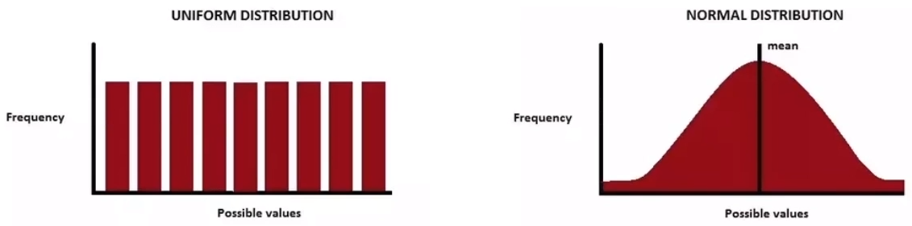

# 1. Tensorflow 2.0과 Pytorch 소개

## 1.1. 챕터 소개

- 각 프레임워크 별 간단 Tutorial
  - 시각화
  - Framework 기초 사용법
  - 예제 데이터 불러오고 다루기
  - Layer 구현 및 파악 & 모델 설계
  - 인공지능 학습


## 1.1.1. TensorFlow

- 1.x에 비해 정말 쉬워졌음
- Numpy Array와 호환이 쉬움
- TensorBoard, TFLite, TPU
- 여전히 많은 사용자들이 사용


### 1.1.2. PyTorch

- Dynamic Graph & Define by Run
- 쉽고 빠르며 파이써닉하다
- 어마어마한 성장률


# 2. tensorflow 2.0 기초 사용법

```python
import numpy as np
import tensorflow as tf
```


## 2.1. Tensor 생성

- []
  
  - List 생성
  
  ```python
  [1, 2, 3]
  [[1, 2, 3], [4, 5, 6]]
  ```


### 2.1.1. Array 생성

tuple이나 list 둘 다 np.array()로 씌어서 array를 만들 수 있다.

```python
arr = np.array([1, 2, 3])
print(arr.shape)
arr = np.array([[1, 2, 3], [1, 2, 3]])
print(arr.shape)
```

```
(3, )
(2, 3)
```


### 2.1.2. Tensor 생성

tf.constant()

- list -> Tensor

  ```python
  tf.constant([1, 2, 3])
  ```

- tuple -> Tensor

  ```python
  tf.constant((1, 2, 3), (1, 2, 3))
  ```

- Array -> Tensor

  ```python
  arr = np.array([1, 2, 3])
  tf.constant(arr)
  ```

  

### 2.1.3. Tensor에 담긴 정보 확인

- shape 확인

  ```python
  arr = np.array([1, 2, 3])
  tensor = tf.constant(arr)
  print(tensor.shape)
  ```

  ```
  TensorShape([3])
  ```

- data type 확인

  - 주의: Tensor 생성할 때도 data type을 정해주지 않기 때문에 data type에 대한 혼동이 올 수 있다.
  - Data Type에 따라 모델의 무게나 성능 차이에도 영향을 줄 수 있다.

  ```python
  print(tensor.dtype)
  ```

  ```
  tf.int32
  ```

- data type 정의

  ```python
  tf.constant([1, 2, 3], dtype=tf.int32)
  ```

- data type 변환

  - Numpy에서 astype()을 주었듯이, TensorFlow에서는 tf.cast를 사용한다.

  ```python
  arr = np.array([1, 2, 3], dtype=np.float32)
  
  arr.astype(np.uint8)
  
  tf.cast(tensor, dtype=tf.uint8)
  ```

- Tensor에서 Numpy 불러오기

  - .numpy()

  ```python
  tensor.numpy()
  ```

  - np.array()

  ```python
  np.array(tensor)
  ```

- type()를 사용하여 numpy array로 변환된 것 확인

  ```python
  type(tensor.numpy())
  ```

  ```
  numpy.ndarray
  ```

  

### 2.1.4. 난수 생성



- Normal Distribution은 중심극한 이론에 의한 연속적인 모양

- Uniform Distribution은 중심 극한 이론과는 무관하며 불연속적이며 일정한 분포

- numpy에서는 normal distribution을 기본적으로 생성

  - np.random.randn()

  ```python
  np.random.randn(9)
  ```

  ```
  array([ 2.24804254,  0.46328841,  0.23765128,  0.27295027, -0.56958741,
          2.1216173 ,  0.32800235,  1.14004362,  0.71363775])
  ```

- tf.random.normal

  - TensorFlow에서 Normal Distribution

  ```python
  tf.random.normal([3, 3])
  ```

  ```
  <tf.Tensor: shape=(3, 3), dtype=float32, numpy=
  array([[-1.9345311 ,  0.1974105 ,  1.1650361 ],
         [-0.14203091,  1.8918549 , -0.35417143],
         [-1.1897193 ,  0.6024721 , -0.8902905 ]], dtype=float32)>
  ```

- tf.random.uniform

  - TensorFlow에서 Uniform Distribution

  ```python
  tf.random.uniform([4, 4])
  ```

  ```
  <tf.Tensor: shape=(4, 4), dtype=float32, numpy=
  array([[0.44426167, 0.07362592, 0.5645573 , 0.73015726],
         [0.3714888 , 0.2901349 , 0.8858013 , 0.25791526],
         [0.65857875, 0.9465771 , 0.28069663, 0.6894628 ],
         [0.27670312, 0.23041391, 0.7504574 , 0.8873346 ]], dtype=float32)>
  ```


# 3. 예제 dataset 소개(MNIST) 및 불러오기

## 3.1. Data Preprocess (MNIST)

```python
import numpy as np
import matplotlibpyplot as plt

import tensorflow as tf

%matplotlib inline
```


## 3.2. 데이터 불러오기

TensorFlow에서 제공해주는 데이터셋(MNIST) 예제 불러오기

```python
from tensorflow.keras import datasets
```

- 데이터 shape 확인하기

```python
mnist = datasets.mnist
(train_x, train_y), (test_x, test_y) = mnist.load_data()
print(train_x.shape)
```

```
(60000, 28, 28)
```


## 3.3. Image Dataset 들여다보기

불러온 데이터셋에서 이미지 데이터 하나만 뽑아서 시각화까지 확인.

- 데이터 하나만 뽑기

  ```python
  image = train_x[0]
  print(image.shape)
  ```

  ```
  (28, 28) # (28, 28, 3)이 아니므로 gray scale
  ```

- 시각화해서 확인

  ```python
  plt.imshow(image, 'gray')
  plt.show()
  ```

  

## 3.4. Channel 관련

[Batch Size, Height, Width, Channel]

GrayScale이면 1, RGH이면 3으로 만들어줘야 한다.

- 다시 shape로 데이터 확인

  ```python
  print(train_x.shape)
  ```

  ```
  (60000, 28, 28)
  ```

- 데이터 차원수 늘리기 (numpy)

  ```python
  expanded_data = np.expand_dims(train_x, -1)
  print(expanded_data.shape)
  ```

  ```
  (60000, 28, 28, 1)
  ```

- TensorFlow 패키지 불러와 데이터 차원수 늘리기 (tensorflow)

  ```python
  new_train_x = tf.expand_dims(train_x, -1)
  print(new_train_x.shape)
  ```

  ```
  TensorShape([60000, 28, 28, 1])
  ```

- TensorFlow 공식홈페이지에서 가져온 방법 tf.newaxis

  ```python
  train_x[..., tf.newaxis].shape
  ```

  ```
  (6000, 28, 28, 1)
  ```

  ```python
  reshaped = train_x.reshape([60000, 28, 28, 1])
  reshaped.shape
  ```

  ```
  (60000, 28, 28, 1)
  ```


*주의 사항

matplotlib로 이미지 시각화 할 때는 gray scale의 이미지는 3번째 dimension이 없으므로, 2개의 dimension으로 gray scale로 차원 조절해서 넣어줘야 한다.

- new_train_x[0] -> new_train_x[0, :, :, 0]

  ```python
  new_train_x = train_x[..., tf.newaxis]
  new_train_x.shape
  ```

  ```
  (60000, 28, 28, 1)
  ```

  
  
  ```python
  np.squeeze(new_train_x)[0].shape # np.squeeze(new_train_x).shape == (60000, 28, 28)
  ```
  
  ```
  (28, 28)
  ```
  
  
  
  ```python
  disp = new_train_x[0, :, :, 0]
    
  plt.imshow(disp, 'gray')
  plt.show()
  ```
  
  
- 다시 시각화

  ```python
  plt.imshow(disp, 'gray')
  plt.show()
  ```

  ![img](data:image/png;base64,iVBORw0KGgoAAAANSUhEUgAAAPsAAAD4CAYAAAAq5pAIAAAABHNCSVQICAgIfAhkiAAAAAlwSFlzAAALEgAACxIB0t1+/AAAADh0RVh0U29mdHdhcmUAbWF0cGxvdGxpYiB2ZXJzaW9uMy4xLjMsIGh0dHA6Ly9tYXRwbG90bGliLm9yZy+AADFEAAAN80lEQVR4nO3df6hcdXrH8c+ncf3DrBpTMYasNhuRWBWbLRqLSl2RrD9QNOqWDVgsBrN/GHChhEr6xyolEuqP0qAsuYu6sWyzLqgYZVkVo6ZFCF5j1JjU1YrdjV6SSozG+KtJnv5xT+Su3vnOzcyZOZP7vF9wmZnzzJnzcLife87Md879OiIEYPL7k6YbANAfhB1IgrADSRB2IAnCDiRxRD83ZpuP/oEeiwiPt7yrI7vtS22/aftt27d281oAesudjrPbniLpd5IWSNou6SVJiyJia2EdjuxAj/XiyD5f0tsR8U5EfCnpV5Ku6uL1APRQN2GfJekPYx5vr5b9EdtLbA/bHu5iWwC61M0HdOOdKnzjND0ihiQNSZzGA03q5si+XdJJYx5/R9L73bUDoFe6CftLkk61/V3bR0r6kaR19bQFoG4dn8ZHxD7bSyU9JWmKpAci4o3aOgNQq46H3jraGO/ZgZ7ryZdqABw+CDuQBGEHkiDsQBKEHUiCsANJEHYgCcIOJEHYgSQIO5AEYQeSIOxAEoQdSIKwA0kQdiAJwg4kQdiBJAg7kARhB5Ig7EAShB1IgrADSRB2IAnCDiRB2IEkCDuQBGEHkiDsQBKEHUii4ymbcXiYMmVKsX7sscf2dPtLly5tWTvqqKOK686dO7dYv/nmm4v1u+66q2Vt0aJFxXU///zzYn3lypXF+u23316sN6GrsNt+V9IeSfsl7YuIs+toCkD96jiyXxQRH9TwOgB6iPfsQBLdhj0kPW37ZdtLxnuC7SW2h20Pd7ktAF3o9jT+/Ih43/YJkp6x/V8RsWHsEyJiSNKQJNmOLrcHoENdHdkj4v3qdqekxyTNr6MpAPXrOOy2p9o++uB9ST+QtKWuxgDUq5vT+BmSHrN98HX+PSJ+W0tXk8zJJ59crB955JHF+nnnnVesX3DBBS1r06ZNK6577bXXFutN2r59e7G+atWqYn3hwoUta3v27Cmu++qrrxbrL7zwQrE+iDoOe0S8I+kvauwFQA8x9AYkQdiBJAg7kARhB5Ig7EASjujfl9om6zfo5s2bV6yvX7++WO/1ZaaD6sCBA8X6jTfeWKx/8sknHW97ZGSkWP/www+L9TfffLPjbfdaRHi85RzZgSQIO5AEYQeSIOxAEoQdSIKwA0kQdiAJxtlrMH369GJ948aNxfqcOXPqbKdW7XrfvXt3sX7RRRe1rH355ZfFdbN+/6BbjLMDyRF2IAnCDiRB2IEkCDuQBGEHkiDsQBJM2VyDXbt2FevLli0r1q+44opi/ZVXXinW2/1L5ZLNmzcX6wsWLCjW9+7dW6yfccYZLWu33HJLcV3UiyM7kARhB5Ig7EAShB1IgrADSRB2IAnCDiTB9ewD4JhjjinW200vvHr16pa1xYsXF9e9/vrri/W1a9cW6xg8HV/PbvsB2zttbxmzbLrtZ2y/Vd0eV2ezAOo3kdP4X0i69GvLbpX0bEScKunZ6jGAAdY27BGxQdLXvw96laQ11f01kq6uuS8ANev0u/EzImJEkiJixPYJrZ5oe4mkJR1uB0BNen4hTEQMSRqS+IAOaFKnQ287bM+UpOp2Z30tAeiFTsO+TtIN1f0bJD1eTzsAeqXtabzttZK+L+l429sl/VTSSkm/tr1Y0u8l/bCXTU52H3/8cVfrf/TRRx2ve9NNNxXrDz/8cLHebo51DI62YY+IRS1KF9fcC4Ae4uuyQBKEHUiCsANJEHYgCcIOJMElrpPA1KlTW9aeeOKJ4roXXnhhsX7ZZZcV608//XSxjv5jymYgOcIOJEHYgSQIO5AEYQeSIOxAEoQdSIJx9knulFNOKdY3bdpUrO/evbtYf+6554r14eHhlrX77ruvuG4/fzcnE8bZgeQIO5AEYQeSIOxAEoQdSIKwA0kQdiAJxtmTW7hwYbH+4IMPFutHH310x9tevnx5sf7QQw8V6yMjIx1vezJjnB1IjrADSRB2IAnCDiRB2IEkCDuQBGEHkmCcHUVnnnlmsX7PPfcU6xdf3Plkv6tXry7WV6xYUay/9957HW/7cNbxOLvtB2zvtL1lzLLbbL9ne3P1c3mdzQKo30RO438h6dJxlv9LRMyrfn5Tb1sA6tY27BGxQdKuPvQCoIe6+YBuqe3XqtP841o9yfYS28O2W/8zMgA912nYfybpFEnzJI1IurvVEyNiKCLOjoizO9wWgBp0FPaI2BER+yPigKSfS5pfb1sA6tZR2G3PHPNwoaQtrZ4LYDC0HWe3vVbS9yUdL2mHpJ9Wj+dJCknvSvpxRLS9uJhx9sln2rRpxfqVV17ZstbuWnl73OHir6xfv75YX7BgQbE+WbUaZz9iAisuGmfx/V13BKCv+LoskARhB5Ig7EAShB1IgrADSXCJKxrzxRdfFOtHHFEeLNq3b1+xfskll7SsPf/888V1D2f8K2kgOcIOJEHYgSQIO5AEYQeSIOxAEoQdSKLtVW/I7ayzzirWr7vuumL9nHPOaVlrN47eztatW4v1DRs2dPX6kw1HdiAJwg4kQdiBJAg7kARhB5Ig7EAShB1IgnH2SW7u3LnF+tKlS4v1a665plg/8cQTD7mnidq/f3+xPjJS/u/lBw4cqLOdwx5HdiAJwg4kQdiBJAg7kARhB5Ig7EAShB1IgnH2w0C7sexFi8abaHdUu3H02bNnd9JSLYaHh4v1FStWFOvr1q2rs51Jr+2R3fZJtp+zvc32G7ZvqZZPt/2M7beq2+N63y6ATk3kNH6fpL+PiD+X9FeSbrZ9uqRbJT0bEadKerZ6DGBAtQ17RIxExKbq/h5J2yTNknSVpDXV09ZIurpXTQLo3iG9Z7c9W9L3JG2UNCMiRqTRPwi2T2ixzhJJS7prE0C3Jhx229+W9Iikn0TEx/a4c8d9Q0QMSRqqXoOJHYGGTGjozfa3NBr0X0bEo9XiHbZnVvWZknb2pkUAdWh7ZPfoIfx+Sdsi4p4xpXWSbpC0srp9vCcdTgIzZswo1k8//fRi/d577y3WTzvttEPuqS4bN24s1u+8886WtccfL//KcIlqvSZyGn++pL+V9LrtzdWy5RoN+a9tL5b0e0k/7E2LAOrQNuwR8Z+SWr1Bv7jedgD0Cl+XBZIg7EAShB1IgrADSRB2IAkucZ2g6dOnt6ytXr26uO68efOK9Tlz5nTUUx1efPHFYv3uu+8u1p966qli/bPPPjvkntAbHNmBJAg7kARhB5Ig7EAShB1IgrADSRB2IIk04+znnntusb5s2bJiff78+S1rs2bN6qinunz66acta6tWrSque8cddxTre/fu7agnDB6O7EAShB1IgrADSRB2IAnCDiRB2IEkCDuQRJpx9oULF3ZV78bWrVuL9SeffLJY37dvX7FeuuZ89+7dxXWRB0d2IAnCDiRB2IEkCDuQBGEHkiDsQBKEHUjCEVF+gn2SpIcknSjpgKShiPhX27dJuknS/1ZPXR4Rv2nzWuWNAehaRIw76/JEwj5T0syI2GT7aEkvS7pa0t9I+iQi7ppoE4Qd6L1WYZ/I/Owjkkaq+3tsb5PU7L9mAXDIDuk9u+3Zkr4naWO1aKnt12w/YPu4FusssT1se7irTgF0pe1p/FdPtL8t6QVJKyLiUdszJH0gKST9k0ZP9W9s8xqcxgM91vF7dkmy/S1JT0p6KiLuGac+W9KTEXFmm9ch7ECPtQp729N425Z0v6RtY4NefXB30EJJW7ptEkDvTOTT+Ask/Yek1zU69CZJyyUtkjRPo6fx70r6cfVhXum1OLIDPdbVaXxdCDvQex2fxgOYHAg7kARhB5Ig7EAShB1IgrADSRB2IAnCDiRB2IEkCDuQBGEHkiDsQBKEHUiCsANJ9HvK5g8k/c+Yx8dXywbRoPY2qH1J9NapOnv7s1aFvl7P/o2N28MRcXZjDRQMam+D2pdEb53qV2+cxgNJEHYgiabDPtTw9ksGtbdB7Uuit071pbdG37MD6J+mj+wA+oSwA0k0Enbbl9p+0/bbtm9toodWbL9r+3Xbm5uen66aQ2+n7S1jlk23/Yztt6rbcefYa6i322y/V+27zbYvb6i3k2w/Z3ub7Tds31Itb3TfFfrqy37r+3t221Mk/U7SAknbJb0kaVFEbO1rIy3YflfS2RHR+BcwbP+1pE8kPXRwai3b/yxpV0SsrP5QHhcR/zAgvd2mQ5zGu0e9tZpm/O/U4L6rc/rzTjRxZJ8v6e2IeCcivpT0K0lXNdDHwIuIDZJ2fW3xVZLWVPfXaPSXpe9a9DYQImIkIjZV9/dIOjjNeKP7rtBXXzQR9lmS/jDm8XYN1nzvIelp2y/bXtJ0M+OYcXCarer2hIb7+bq203j309emGR+YfdfJ9OfdaiLs401NM0jjf+dHxF9KukzSzdXpKibmZ5JO0egcgCOS7m6ymWqa8Uck/SQiPm6yl7HG6asv+62JsG+XdNKYx9+R9H4DfYwrIt6vbndKekyjbzsGyY6DM+hWtzsb7ucrEbEjIvZHxAFJP1eD+66aZvwRSb+MiEerxY3vu/H66td+ayLsL0k61fZ3bR8p6UeS1jXQxzfYnlp9cCLbUyX9QIM3FfU6STdU92+Q9HiDvfyRQZnGu9U042p43zU+/XlE9P1H0uUa/UT+vyX9YxM9tOhrjqRXq583mu5N0lqNntb9n0bPiBZL+lNJz0p6q7qdPkC9/ZtGp/Z+TaPBmtlQbxdo9K3ha5I2Vz+XN73vCn31Zb/xdVkgCb5BByRB2IEkCDuQBGEHkiDsQBKEHUiCsANJ/D+f1mbtgJ8kQQAAAABJRU5ErkJggg==)
  
  

### 3.5. Label Dataset 들여다보기

Label 하나를 열어서 Image와 비교하여 제대로 들어갔는지. 어떤 식으로 저장되어 있는지 확인

- label 하나만 뽑기

  ```python
  train_y.shape
  ```

  ```
  (60000,)
  ```

  ```python
  train_y[0]
  ```
  
  ```
  5
  ```
  
- Label 시각화

  ```python
  plt.title(train_y[0])
  plt.imshow(train_x[0], 'gray')
  plt.show()
  ```

  