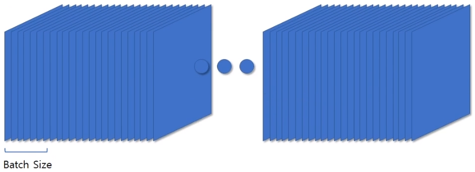
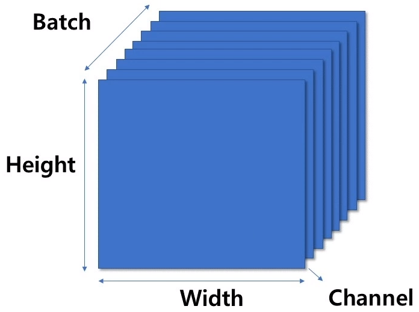

# 1. 개요

## 1.1. 목적

- 간단한 기본 예시 데이터로 학습 말고, 실전에서 사용할 수 있는 TensorFlow와 PyTorch 사용
- 모델 성능 향상에 필요한 추가 기본 방법
- 캐글이나 실전에서 필요한 방법들 소개


## 1.2. 강의 구성

- 예제가 아닌 custom한 데이터를 넣는 방법
- 이미지 전처리 (Augmentation) 하는 방법
- Callbacks를 통해 TensorBoard, Learning Rate Schedule, Checkpoint
- 모델 저장 및 로드


### 1.2.1. Custom한 데이터 넣는 방법

엄청 고급적인 기술이거나 어려운 기술은 아니지만, 앞에서는 예제로라도 모델을 돌릴 수 있는 수준

이번에는 Custom한 데이터이든 캐글에서든 데이터를 받게 되면 직접 모델에 적용해볼 수 있는 비교적 실전형


### 1.2.2. 이미지 전처리

요리를 할 때 재료를 다듬어서 후라이팬이나 조리기에 넣는 듯 데이터도 다듬어서 넣어야 함


### 1.2.3. Augmentation

데이터를 증폭시켜 다양하게 이미지에 변화주어 모델에 적용

Augmentation을 통해 여러 환경에서도 적응이 되도록 모델에게 하드 트레이닝


### 1.2.4. Callbacks

모델이 학습 도중 Epoch 또는 Step 단위로 이벤트를 일으키는 옵션

- TensorBoard는 완전 실시간이 아니라 정해진 타이밍에 실행시켜 기록을 담음
- Learning Rate Schedule. Learning Rate을 하나로만 고정하는 것이 아닌 진행할 때 마다 LR을 줄여 Loss가 튀는 것을 방지
- Checkpoint. 모델 학습 도중 학습된 Weight를 저장. 기본으로는 매 Epoch 마다 저장하고 이때 성능이 향상 되었을 때만 저장 가능


### 1.2.5. 모델 저장 및 불러오기

앞서 배운 Weight만 저장하는 것과는 다르게 모델 구조 및 optimizer도 저장 가능

학습 도중에는 Model이나 optimizer까지 저장할 필요는 없음

Model과 otimizer도 함께 저장해두면 나중에 이어서 학습하기 용이

Weight만 저장하여 Transfer Learning에도 적용 가능


# 2. 데이터 준비하기

```python
import os
from glob import glob

import numpy as np

import tensorflow as tf
from PIL import Image

import matplotLib.pyplot as plt
%matplotlib inline
```

```
os.getcwd() # 현재 경로
```

```python
os.listdir('dataset/mnist_png/')
```

```python
data_paths = glob('dataset/mnist_png/training/0/*.png')
```

```python
data_paths[0]
len(data_paths)
```


# 3. 이미지 분석

## 3.1. 데이터 분석 (MNIST)

```python
os.listdir('dataset/mnist_png/training/')
len(os.listdir('dataset/mnist_png/training/'))
label_nums = os.listdir('dataset/mnist_png/training/')
label_nums

# Label 0의 데이터 갯수 확인
len(label_nums)
```


### 3.1.1. 데이터 별 갯수 비교

```python
nums_dataset = []

for lbl_n in label_nums:
    data_per_class = os.listdir('dataset/mnist_png/training/' + lbl_n)
    nums_dataset.append(len(data_per_class))
    
print(label_nums)
print(nums_dataset)
```

```
['0', '1', '2', '3', '4', '5', '6' , '7', '8', '9']
[5923, 6742, 5958, 6131, 5842, 5421, 5918, 6265, 5851, 5949]
```


```python
plt.bar(label)nums, nums_dataset)
plt.title('Number of Dataset per class')
plt.show()
```


### 3.2. Pillow로 열기

```python
image_path = Image.ioen(path)
image = np.array(image_pil)

print(image.shape)
```

```
(28, 28)
```


```python
plt.imshow(image, 'gray')
plt.show()
```


## 3.3. TensorFlow로 열기

```python
gfile = tf.io.read_file(path)
image = tf.io.decode_image(gfile)

print(image.shape)
```

```
TensorShape([28, 28, 1]) # 체널이 3개이다. 즉, 3차원.
```


```python
# plt.imshow(image, 'gray') 는 체널이 하나 더 많아서 실행이 안된다.
plt.imshow(image[:, :, 0], 'gray')
plt.show()
```


## 3.4. Label 얻기

```python
print(path)
label = path.split('\\')[-2]
print(int(label)
```

```
'dataset/mnist_png/training\\0\\1.png'
0
```


```python
def get_label(path):
    class_name = path.split('\\')[-2]
    label = int(class_name)
    return label
```

```python
path, get_label(path)
```

```
('dataset/mnist_png/training\\0\\1.png', 0)
```


## 3.5. 데이터 이미지 사이즈 알기

```python
from tqdm import tqdm_notebook
```

```python
heights = []
widths = []

for path in tqdm_notebook(data_paths):
    img_pil = Image.open(path)
    image = np.array(img_pil)
    h, w = image.shape
    
    heights.append(h)
    widths.append(w)
```


```python
np.unique(heights)
np.unique(widths)
```

```
28
28
```


```python
plt.figure(figsize=(20, 10))

plt.subplot(121)
plt.hist(heights)
plt.title('Heights')
plt.axvline(np.mean(heights), color='r', linestyle='dashed', linewidth=2)

plt.subplit(122)
plt.hist(widths)
plt.title('Widths')

plt.show()
```


# 4. 데이터의 학습에 대한 이해

```python
import os
from glob import glob

import numpy as np
import tensorflow as tf

import matplotlib.pyplot as plt
%matplotlib inline
```

```python
data_paths = glob('dataset/cifar/train/*.png')
os.listdir('dataset/cifar/train/')[0]
```


```python
def read_image(path):
    gfile = tf.io.read_file(path)
    image = tf.io.decode_image(gfile, dtype=tf.float32)
    return image
```

```python
for i in range(8):
    plt.imshow(read_image(data_paths[i]))
    plt.show
```


## 4.1. Batch



​	

### 4.1.1. Images in List

```python
batch_images = []

for path in data_paths[:8]:
    image = read_image(path)
    batch_images.append(image)
```

```python
np.array(batch_images).shape # 단, 이미지 크기가 다 똑같아야한다.
# (8, 32, 32, 3)
```


### 4.1.2. Batch Size



(batch_size, height, width, channel)

```python
def make_batch(batch_paths):
    batch_images = []
    
    for path in batch_paths:
        image = read_image(path)
        batch_images.append(image)
        
    retrun tf.convert_to_tensor(batch_images)
```


```python
batch_size = 16

for step in range(4):
    batch_images = make_batch(data_paths[step * batch_size: (step + 1) * batch_size])
    
    plt.imshow(batch_images[0])
    plt.show()
```


# 5. fit_generator - Image Transformation

```python
import os
from glob import glob

import tensorflow as tf
import numpy as np

import matplotlib.pyplot as plt
%matplotlib inline
```

```python
data_paths = glob('dataset/mnist_png/training/0/*.png')
```

```python

```


## 5.1. Load Image

```python
gfile = tf.io.read_file(path)
image = tf.io.decode_image(gfile)
image.shape
```

```python
plt.imshow(image[:, :, 0], 'gray')
plt.show()
```


## 5.2. Set Data Generator

```python
from tensorflow.keras.preprocessing.image import ImageDataGenerator
```

```python
datagen = ImageDataGenerator(
rotation_range=20,
width_shift_range=0.2,
height_shift_range=0.2,
horizontal_flip=True
)
```


```python
inputs = image[tf.newaxis, ...]
inputs.shape
```

```python
image = next(iter(datagen.flow(inputs)))
image.shape
```


```python
plt.subplot(121)
plt.title('Original')
plt.imshow(np.squeeze(inputs), 'gray')

plt.subplot(122)
plt.title('Transformed Image')
plt.imshow(np.squeeze(image), 'gray')
plt.show()
```


## 5.3. Transformation

- width_shift_range
- height_shift_range
- brightness_range
- zoom_range
- horizontal_flip
- vertical_flip
- rescale
- preprocessing_function

```python
datagen =  ImageDataGenerator(
width_shift_range=0.3)

outputs = next(iter(datagen.flow(inputs)))

plt.subplot(121)
plt.title("Original Image")
plt.imshow(np.squeeze(inputs), 'gray')

plt.subplot(122)
plt.title('Transformed Image')
plt.imshow(np.squeeze(image), 'gray')
plt.show()
```


## 5.4. Rescale시 주의사항


## 5.5.


## 5.6


# 7. flow_from_dataframe - dataframe 만들기

```python
import cs
from glob import glob

import numpy as np
import pandas as pd

import matplotlib.pyplot as plt

%matplotlib inline
```


## 7.1. 파이썬 문자열 관련 함수 사용

- os
- glob
- replace
- split
- join
- strip


```python
os.listdir('dataset/cifar/')
```

```python
train_paths = glob('dataset/cifar/train/*.png')
test_paths = glob('dataset/cifar/test/*.png')
```


# 19. save and load model - h5

## 19.1. Saving Model

```python
save_path = 'my_model.h5'
model.save(save_path, include_optimizer=True)
```


```python
model = tf.keras.models.load_model('my_model.h5')
```


## 19.2. Save Model - 2

```python
model.save_weights('model_weights.h5')
```

```python
with open('model_architecture.json', 'w') as f:
    f.write(model.to_json())
```


```python
from tensorflow.keras.models import model_from_json
```

```python
with open('model_architecture.json', 'r') as f:
    model = model_from_json(f.read())
```

```python
model.load_weights('model_weights.h5')
```

> model.load_weights('checkpoints') 이런 식으로 checkpoint가 담긴 폴더를 지정해주면 checkpoint도 불러올 수 있다.


## 19.3. H5 모델 들여다보기

```python
import h5py

model_file = h5py.File('my_moel.h5', 'r+')
model_file.keys()
```

```python
model_file['model_weights'].keys()
```

```python
model_file['model_weights']['conv2d']['conv2d'].keys()
```

```python
model_file['model_weights']['conv2d']['conv2d'].['kernel:0']
```

```python
weight = np.array(model_file['model_weights']['conv2d']['conv2d'].['kernel:0'])
```

