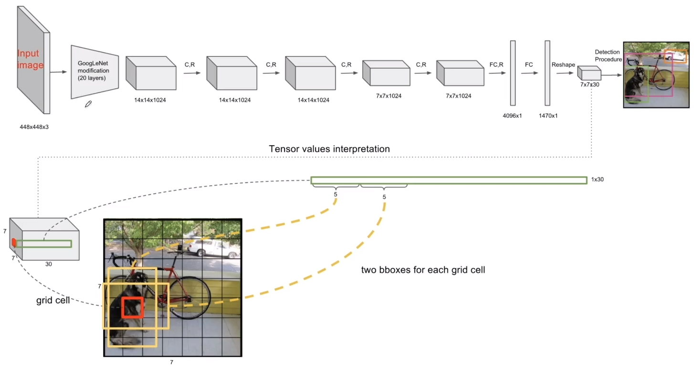

# 12. Multi Object Detection - 01. Image Object Detection의 소개와  응용 분야들

## 12.1. Object Detection

- Classification : 분류
- Localization : 전체 이미지에서 어느 위치에 있는지
- Bounding Box : 위치를 표시해주는 박스
- Object Detection : 객체를 개별적으로 구분 (Classification + Localization)
- Instance Segmentation : 객체의 경계를 정확히 아는 것, 객체 간의 차이로 구분

##### Object Detection = Multi-Labeled Classification + Bounding Box Regression(Localization)

## 12.2. 1-Stage, 2-Stage Detectors

##### 성능이 좋았던 모델은 주황색

# 15. YOLO - 1

​	

