# 1. Machine Learning의 개념

## 1.1. 커리큘럼

- Part1 : Machine Learning의 개념과 종류
- Part2 : 회귀분석 - 통계학기초, 회귀분석, PCA
- Part3 : Machine Learning알고리즘 - KNN, LDA, SVM, DecisionTree, ANN
- Part4 : Ensemble Learning - Bagging, Boosting, RandomForest, Stacking
- Part5 : Clustering - Kmeans, Hierachical, DBSCAN
- Part6 : Class imbalanced problem - Oversampling, Undersampling
- Part7 : 빅콘테스트 후기

Ensemble Learning : kaggle 등 대회에서 항상 우승하는 알고리즘

Clustering : 데이터 그룹화

Class imbalanced problem : 반도체 데이터에서 반도체가 정상이냐 불량이냐가 존재하는데 대부분 0.01% 미만, 머신러닝을 돌릴 경우 모든 데이터에 대해서 머신러닝 모델이 정상이라고 표시하는 문제가 발생.

빅콘테스트 : 국내에서 가장 큰 빅데이터 대회

## 1.2. Machine Learning의 개념

- "무엇(X)으로 무엇(Y)을 예측하고 싶다"

데이터(행렬)

| 성별 |  키  | 몸무게 | 체지방 | BMI지수 | 폐활량 | 흡연여부 |
| :--: | :--: | :----: | :----: | :-----: | :----: | :------: |
|  남  | 182  |   78   |   18   |   15    |   86   |    Y     |
|  여  | 156  |   52   |   25   |   17    |   95   |    N     |
|  여  | 165  |   58   |   21   |   19    |   98   |    N     |
| ...  | ...  |  ...   |  ...   |   ...   |  ...   |   ...    |

예측하고 싶은 대상(Y)가 정해지면 나머지 데이터가 X에 해당한다.

### 1.2.1. 머신러닝이란?

- 기계 학습 또는 머신 러닝(영어: machine learning)은 인공 지능의 한 분야로, 컴퓨터가 학습할 수 있도록 하는 알고리즘과 기술을 개발하는 분야를 말한다 (위키피디아)

  - $$
    Y = f(X)
    $$

  - 출력 변수 (종속변수, 반응변수) = 모형(머신 러닝 알고리즘), 입력 변수(독립변수, feature)

    - 종속변수 : 두 변수 중 한 변수의 값이 결정되는 데 따라 그 값이 결정되는 다른 변수
    - 반응변수 : 독립 변수의 변화에 따라 값이 결정되는 다른 변수
    - 독립변수 : 함수 관계에서, 다른 변수의 변화와는 관계없이 독립적으로 변화하고 이에 따라 다른 변수의 값을 결정하는 변수
    - 참고, https://enook.jbnu.ac.kr/contents/39/#!/p/20

- 주어진 데이터를 통해서 입력변수와 출력변수간의 관계를 만드는 함수 f를 만드는 것

- 주어진 데이터 속에서 데이터의 특징을 찾아내는 함수 f를 만드는 것

### 1.2.2. 머신러닝으로 할 수 있는 것들

X : 고객들의 개인 정보 및 금융 관련 정보, Y : 대출 연체 여부 -> 대출 연체자 예측 탐지 모델, 대출 연체 관련 주요 feature 추출

X : 게임 유저들의 게임 내 활동 정보, Y : 게임 이탈 여부 / 어뷰징 여부 -> 이상 탐지 모델

X : 숫자 손 글씨 데이터, Y : 숫자 라벨(0~9) -> 숫자 이미지 분류 모델

X : 상품 구매 고객 특성 정보 -> 군집화를 통한 고객 특성에 따른 segmentation (그룹화)

X : 고객들의 상품 구매 내역 -> 매장내 상품 진열 위치 리뉴얼을 통한 매출 증대

X : 쇼핑몰 페이지 검색 및 클릭 로그 기록 -> 맞춤 상품 추천 시스템

X : SNS데이터 및 뉴스 데이터 -> 소셜 및 사회 이슈 파악

### 1.2.3. 함수 f란 무엇인가(회귀 분석인 경우)

> 회귀 분석이란
>
> 관찰된 연속형 변수들에 대해 두 변수 사이의 모형을 구한 뒤 적합도를 측정해 내는 분석 방법

- f를 구하기 위해서 입력 변수와 출력 변수가 필요함
- p개의 입력 변수 X1, X2, ..., Xp가 있고, 출력 변수 Y가 있을 때, X = (X1, X2, ..., Xp)라 하면 입력 변수와 출력 변수의 관계를 나타내는 식은 다음과 같음

# 2. 지도학습과 비지도학습

## 2.1. 지도 학습(supervised learning)

Y = f(X) 에 대하여 입력 변수 (X)와 출력 변수(Y)의 관계에 대하여 모델링하는 것 (Y에 대하여 예측 또는 분류하는 문제)

- 회귀 (regression) : 입력 변수 X에 대해서 연속형 출력 변수 Y를 예측
- 분류 (classification) : 입력 변수 X에 대해서 이산형 출력 변수 Y(class)를 예측

Y가 연속형 변수이냐 이산형 변수(클래스)이냐로 구분

## 2.2. 비지도 학습(unsupervised learning)

- 출력 변수(Y)가 존재하지 않고, 입력 변수(X)간의 관계에 대해 모델링 하는 것
- 군집 분석 - 유사한 데이터끼리 그룹화
- PCA - 독립변수들의 차원을 축소화

(현실에는 labeled data가 많지 않다)

## 2.3. 강화학습(reinforcement learning)

- 수 많은 시뮬레이션을 통해 현재의 선택이 먼 미래에 보상이 최대가 되도록 학습
- Agent가 action을 취하고 환경에서 보상을 받고 이 보상이 최대가 되도록 최적의 action을 취하는 방법을 배움

## 2.4. 정리

- 지도학습
  - Input/Output
  - Labeled data
  - ex) 주식가격 예측 (지도학습, 회귀)
  - ex) 공정 불량 여부 탐지 (지도학습, 분류)
- 비지도학습
  - Input
  - Unlabeled data
  - ex) 고객 segmentation (비지도 학습, 군집화)
- 강화학습
  - No data s
  - State & action
  - Simulation
  - Decision
  - ex) AlphaGo

# 3. Machine Learning의 종류

## 3.1. 선형 회귀분선 (Linear Regression)

- 독립변수와 종속변수가 선형적인 관계가 있다라는 가정하에 분석
- 직선을 통해 종속변수를 예측하기 때문에 독립변수의 중요도와 영향력을 파악하기 쉬움

## 3.2. 의사결정나무 (Decision Tree)

- 독립 변수의 조건에 따라 종속변수를 분리 (비가 내리다 -> 축구를 하지 않는다)
- 이해하기 쉬우나 overfitting이 잘 일어남

## 3.3. KNN (K-Nearest Neighbor)

- 새로 들어온 데이터의 주변 k개의 데이터의 class로 분류하는 기법

hyperparameter : 사람이 지정해 주어야 하는 변수

## 3.4. Neural Network

- 입력, 은닉, 출력층으로 구성된 모형으로서 각 층을 연결하는 노드의 가중치를 업데이트하면서 학습

overfitting 되기 쉽다는 이유로 일찍부터 쓰이진 않았다.

## 3.5. SVM (Support Vector Machine)

- Class 간의 거리(margin)가 최대가 되도록 decision boundary를 만드는 방법

<strong>*어느 정도의 오차를 허용한다.</strong>

요즘에는 잘 쓰이지 않는다.

학습에 오래 걸리는 모델이며, 데이터가 커질수록 시간은 훨씬 오래 걸린다.

## 3.6. Ensemble Learning

- 여러 개의 모델(classifier or base learner)을 결합하여 사용하는 모델

ex) bagging, random forest, boosting => tree들을 building block으로 활용한 모델

## 3.7. K-means clustering

- Label 없이 데이터의 군집으로 k개로 생성

K를 알맞게 설정해주지 않으면 안된다.

데이터가 고차원일 경우 잘 맞지 않는다.

# 4. 딥러닝 주요 모델 - 1

## 4.1. Deep Learning

-  다층의 layer를 통해 복잡한 데이터의 학습이 가능토록 함 (graphical representation learning)
- 알고리즘 및 GPU의 발전이 deep learning의 부흥을 이끔

이미지 처리에 사용되는 CNN (Convolutional Neural Network)

### 4.1.1. 이미지 분류에서 기존 모델

- 각각의 픽셀 값(늘어뜨려서)을 독립변수로 사용
- 독립변수들을 각각 독립이라는 기본적인 가정에서 어긋남

### 4.1.2. Convolutional Neural Network

- 이미지의 지역별 feature를 뽑아서 neural network 학습
- Region feature (graphical feature)

### 4.1.3. RNN, AutoEncoder

- RNN (순환신경망) : 히든 노드가 방향을 가진 엣지로 연결돼 순환구조를 이루는(directed cycle) 인공신경망의 한 종류
- AutoEncoder : 입력을 출력으로 복사하는 신경망

### 4.1.4. 다양한 분야로 발전한 딥러닝

### 4.1.5. 네트워크 구조의 발전(ResNET, DenseNet 등)

### 4.1.6. Deep Learning

- 네트워크 초기화 기법(Xavier, he initialization 등)
- 다양한 activation function(ReLu, ELU, SeLU, Leaky ReLU 등)
- Generalization, overfitting에 관한 문제
- Semi-supervised learning, Unsupervised learning

# 5. 딥러닝 주요 모델 - 2

## 5.1. GAN(Generative Adversarial Network), 생산적 적대 신경망

Data를 만들어내는 Generator와 만들어진 data를 평가하는 Discriminator가 서로 대립(Adversarial)적으로 학습해가며 성능을 점차 개선해 나가자는 개념

- Discriminator를 학습시킬 때에는 D(x)가 1이 되고 D(G(z))가 0이 되도록 학습시킴

  (진짜 데이터를 진짜로 판별하고, 가짜데이터를 가짜로 판별할 수 있도록)

- Generator를 학습시킬 때에는 D(G(z))가 1이 되도록 학습시킴

  (가짜 데이터를 discriminator가 구분못하도록 학습, discriminator를 헷갈리게 하도록)

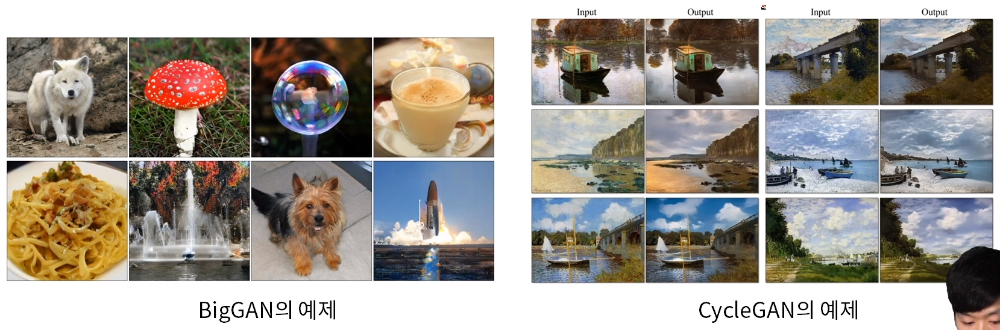

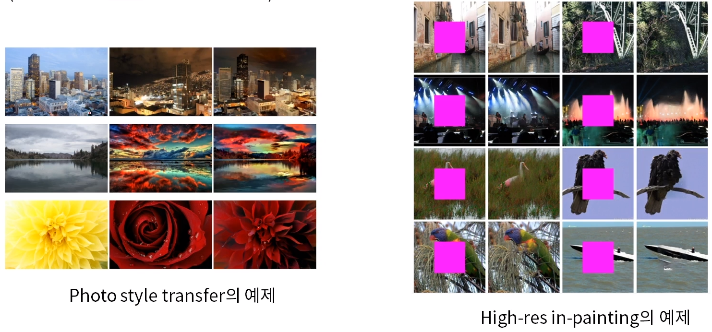

## 5.2. 강화학습 (Reinforcement Learning)

- Q-learning
  - 현재 상태에서부터 먼 미래까지 가장 큰 보상을 얻을 수 있는 행동을 학습하게 하는 것
  - (강화학습의 정의와 어떤 차이가 있는가?)
  - 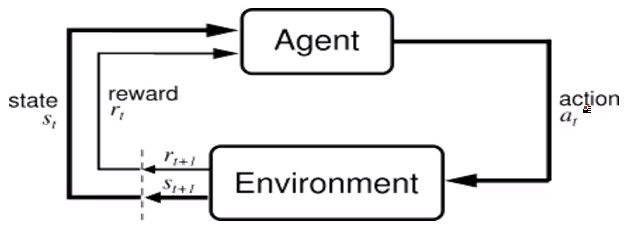
- Q-learning + Deep Learning : DQN (Deep Reinforcement Learning)
  - 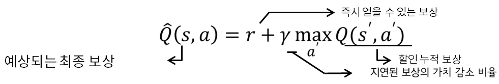

### 5.2.1. Deep Reinforcement Learning

- 더 효율적으로 빠르게 학습 할 수 있는 강화학습 모델
- Action이 continuous한 경우
- Reward가 매우 sparse한 경우 (희박한 경우)
- Multi agent 강화학습 모델

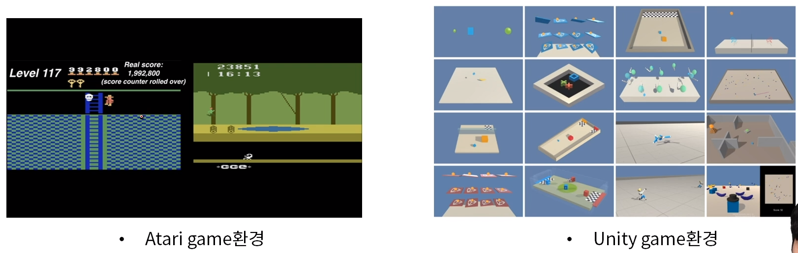

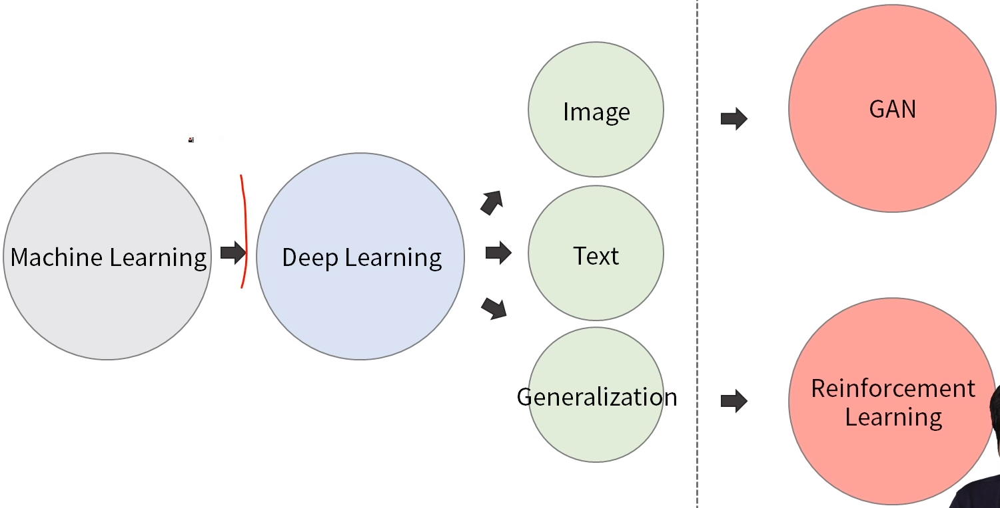

# 6. 모형의 적합성 평가 및 실험설계 - 1

## 6.1. 모형의 적합성을 평가하는 방법

- 모형의 복잡도에 따라 학습 집합의 MSE(회색)와 검증 집합의 MSE(빨간색)의 변화는 아래 그림과 같음
- 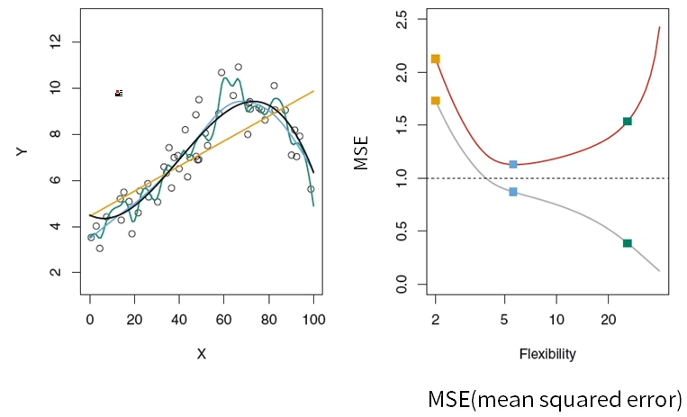
  - <strong>MSE는 낮을수록 좋다</strong>
  - 검은색: 실제 f를 나타내는 모형
  - 노란색: 가장 낮은 복잡도를 가지므로 <strong>편파성이 높아져</strong> 가장 높은 MSE 값을 가짐
  - 초록색: 가장 높은 복잡도를 가지므로 학습 집합에 과적합 되어 <strong>분산이 높아짐</strong>. 따라서 검증 데이터의 MSE가 하늘색에 비해 상승함
  - 하늘색: 검은색 모형과 가장 유사한 형태로, <strong>분산과 편파성이 모두 적절히 낮아져</strong> 검증 데이터의 MSE가 가장 낮음
- 학습 집합의 MSE는 복잡한 모형일수록 감소하지만, 학습 데이터가 아닌 또 다른 데이터(검증 데이터)의 MSE는 일정 시점 이후로 증가
- 증가하는 원인은 왼쪽 그림과 같이 모형의 학습 집합에 과적합되기 때문

## 6.2. 데이터 분할

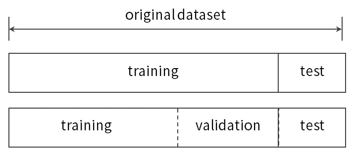

과적합을 방지하기 위해 전체 데이터를 학습 데이터, 검증 데이터, 테스트 데이터로 나누며 보통 비율은 5:3:2로 정함

- 학습 데이터(training data): 모형 f를 추정하는데 필요
- 검증 데이터(validation data): 추정한 모형 f가 적합한지 검증함
- 테스트 데이터(test data): 최종적으로 선택한 모형의 성능을 평가

> validation data가 필요한 이유
>
> validation 결과를 보고 hyperparameter 값(K)을 수정한다 => validation에 대해 overfitting 될 수 있다
>
> test결과를 보고 hyperparameter를 수정하면 안됨 (실험 설계가 잘못된 것)
>
> hyperparameter를 수정할 일이 없다면 training / test 로 나누어도 좋다

### 6.2.1 순서도

1. 데이터 분할
   - 전체 데이터를 학습 데이터, 검증 데이터, 테스트 데이터로 나눔
2. 모형 학습
   - 학습 데이터를 사용하여 각 모형을 학습함
3. 모형 선택
   - 검증 데이터를 사용하여 각 모형의 성능을 비교하고 모형 선택
4. 최종 성능 지표 도출
   - 테스트 데이터를 사용하여 검증 데이터로 도출한 최종 모델의 성능 지표를 계산함
   - 모형 B의 최종 성능 지표는 3.77이라고 할 수 있음
   - 데이터를 어떻게 분리하느냐에 따라 성능에 영향이 달라지며, 이는 최종 모형 선택에 영향을 끼칠 수 있음 (k-fold cross validation)

## 6.3. k-Fold 교차검증(k-Fold Cross Validation)

- 모형의 적합성을 보다 객관적으로 평가하기 위한 방법
- 데이터를 k(주로 5 또는 10)개 부분으로 나눈 뒤, 그 중 하나를 검증 집합, 나머지를 학습 집합으로 분류
- 위 과정을 k번 반복하고 k개의 성능 지표를 <strong>평균하여</strong> 모형의 적합성을 평가

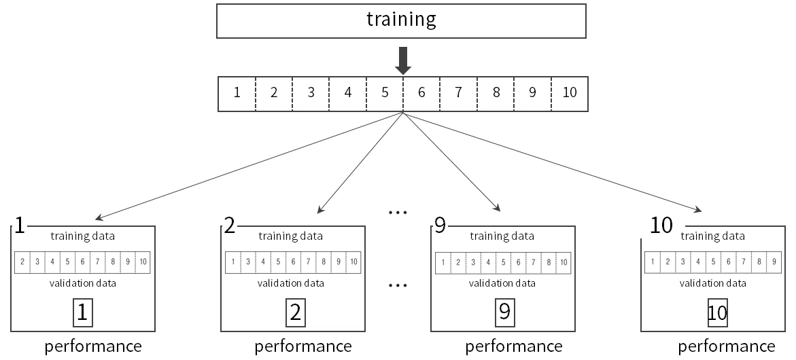

## 6.4. LOOCV(Leave-One-Out Cross Validation)

- 데이터의 수가 적을 때 사용하는 교차검증 방법
- 총 n(데이터 수 만큼)개의 모델을 만드는데, 각 모델은 하나의 샘플만 제외하면서 모델을 만들고 제외한 샘플로 성능 지표를 계산함. 이렇게 도출된 n개의 성능 지표를 평균 내어 최종 성능 지표를 도출

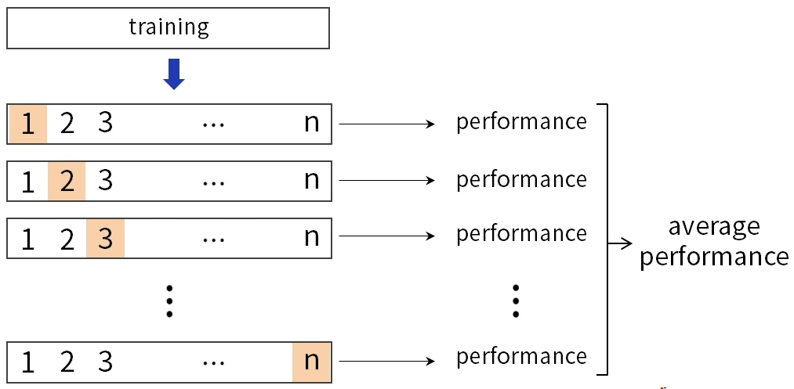

> 극단적인 k-Fold Cross Validation 이라고 생각하면 편함

# 7. 모형의 적합성 평가 및 실험설계 - 2

## 7.1. 데이터 분석과정

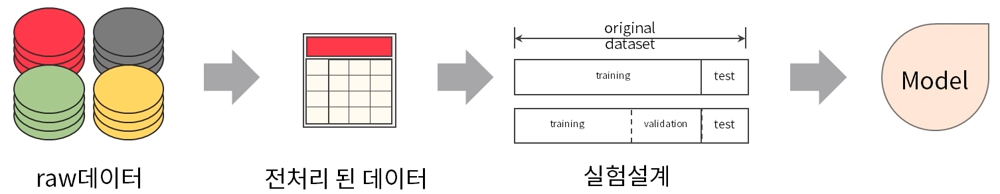

## 7.2. 전처리

- raw데이터를 모델링 할 수 있도록 데이터를 병합 및 파생 변수 생성
- Ex) 게임 유저 이탈 예측 문제
  - 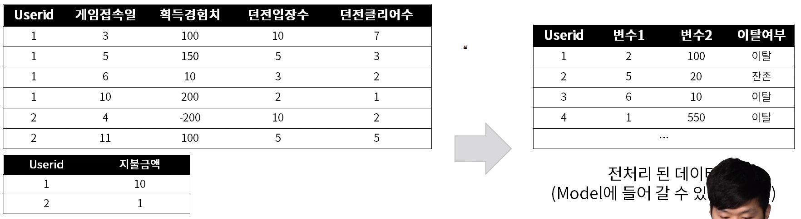
  - 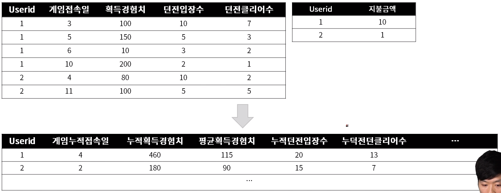
  - 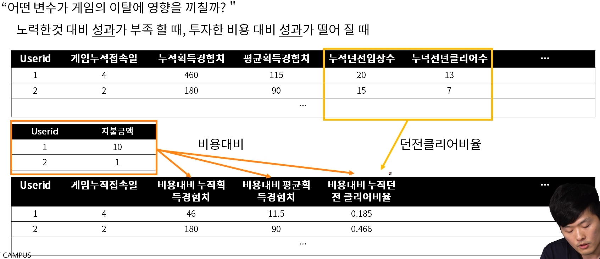
  - 데이터를 병합하고 파생 변수를 만드는 과정이 매우 중요하다. 의미있는 파생 변수가 모델을 잘 훈련시킨다.

## 7.3. 실험설계

- 실험설계에서 test데이터는 실제로 우리가 모델을 적용을 한다는 가정하여야 함
- train, validation 데이터에 test정보는 없어야 함

> 실험설계 과정에서 굉장히 많은 실수가 발생한다.

### 7.3.1. Ex) 반도체 설비 parameter를 통해 반도체 두께를 예측하고 싶은 경우

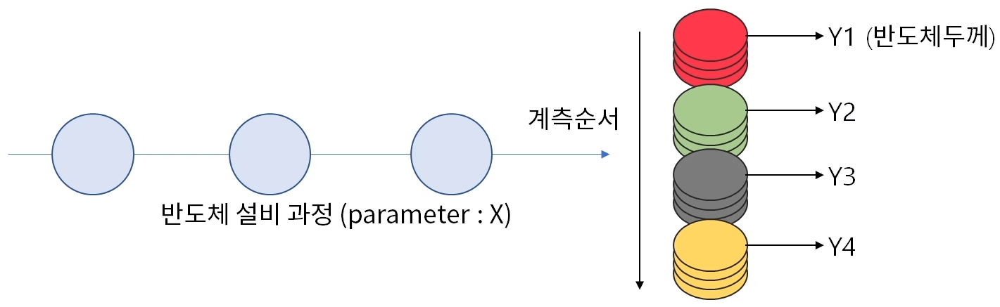

### 7.3.2. Ex) Class imbalance 한 경우

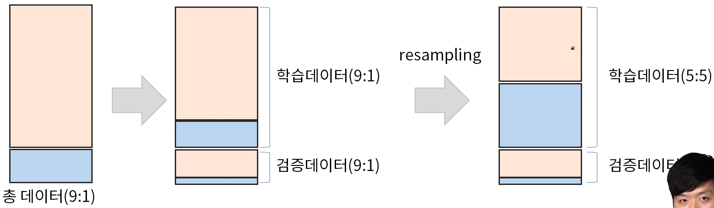

> <strong>학습데이터 내에서는 resampling</strong>

# 8. 과적합(Overfitting)이란

## 8.1. 과적합이란

- 복잡한 모형일수록, 데이터가 적을수록 과적합이 일어나기 쉬움
- 아래 그림은 회귀분석에서 고차항을 넣었을 때 만들어지는 직선
- 과적합은 data science 뿐만 아니라 AI전반적으로 매우 큰 이슈

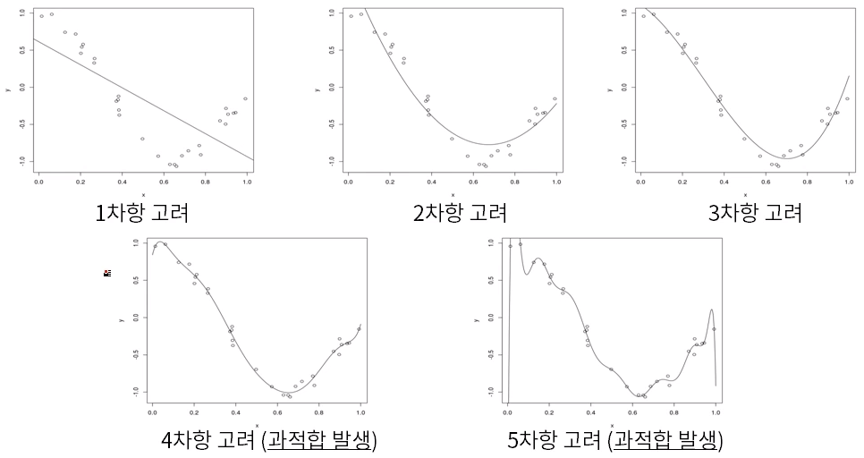

> 'overfitting을 없앤다' 라는 방법론은 존재하지 않다.

## 8.2. 분산(Variance)과 편파성(Bias)의 트레이드오프(Tradeoff) (Dilemma)

- 모형 f^(X) 로 모집단의 전체 데이터를 예측할 때 발생하는 총 error를 계산하면 reducible error와 irreducible error로 표현되며, reducible error는 다시 분산과 편파성으로 구성
  - 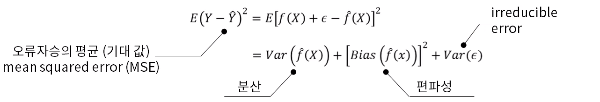
- 분산: 전체 데이터 집합 중 다른 학습 데이터를 이용했을 때, f^이 변하는 정도(복잡한 모형일수록 분산이 높음)
- 편파성: 학습 알고리즘에서 잘못된 가정을 했을 때 발생하는 오차 (간단한 모형일수록 편파성이 높음)
- 복잡한 모형 f^(X)을 사용하여 편파성을 줄이면, 반대로 분산이 커짐 (간단한 모형일 경우엔 반대의 현상이 일어남)
- 따라서 분산과 편파성이 작은 모형을 찾아야 함

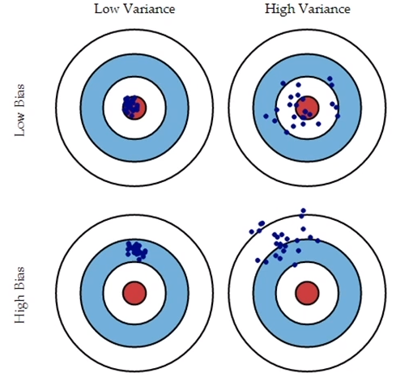

적절한 모형 선택과 실험 설계를 통한 과적합 방지

> Low Variance 이면서 Low Bias인 모델은 없다.
>
> 때문에 차선책은 High Variance > High Bias, (Low Bias, High Variance)에 해당하는 ensemble learning이 성적이 좋다

