# 1. Machine Learning의 개념

## 1.1. 커리큘럼

- Part1 : Machine Learning의 개념과 종류
- Part2 : 회귀분석 - 통계학기초, 회귀분석, PCA
- Part3 : Machine Learning알고리즘 - KNN, LDA, SVM, DecisionTree, ANN
- Part4 : Ensemble Learning - Bagging, Boosting, RandomForest, Stacking
- Part5 : Clustering - Kmeans, Hierachical, DBSCAN
- Part6 : Class imbalanced problem - Oversampling, Undersampling
- Part7 : 빅콘테스트 후기

Ensemble Learning : kaggle 등 대회에서 항상 우승하는 알고리즘

Clustering : 데이터 그룹화

Class imbalanced problem : 반도체 데이터에서 반도체가 정상이냐 불량이냐가 존재하는데 대부분 0.01% 미만, 머신러닝을 돌릴 경우 모든 데이터에 대해서 머신러닝 모델이 정상이라고 표시하는 문제가 발생.

빅콘테스트 : 국내에서 가장 큰 빅데이터 대회

## 1.2. Machine Learning의 개념

- "무엇(X)으로 무엇(Y)을 예측하고 싶다"

데이터(행렬)

| 성별 |  키  | 몸무게 | 체지방 | BMI지수 | 폐활량 | 흡연여부 |
| :--: | :--: | :----: | :----: | :-----: | :----: | :------: |
|  남  | 182  |   78   |   18   |   15    |   86   |    Y     |
|  여  | 156  |   52   |   25   |   17    |   95   |    N     |
|  여  | 165  |   58   |   21   |   19    |   98   |    N     |
| ...  | ...  |  ...   |  ...   |   ...   |  ...   |   ...    |

예측하고 싶은 대상(Y)가 정해지면 나머지 데이터가 X에 해당한다.

### 1.2.1. 머신러닝이란?

- 기계 학습 또는 머신 러닝(영어: machine learning)은 인공 지능의 한 분야로, 컴퓨터가 학습할 수 있도록 하는 알고리즘과 기술을 개발하는 분야를 말한다 (위키피디아)

  - $$
    Y = f(X)
    $$

  - 출력 변수 (종속변수, 반응변수) = 모형(머신 러닝 알고리즘), 입력 변수(독립변수, feature)

- 주어진 데이터를 통해서 입력변수와 출력변수간의 관계를 만드는 함수 f를 만드는 것

- 주어진 데이터 속에서 데이터의 특징을 찾아내는 함수 f를 만드는 것

### 1.2.2. 머신러닝으로 할 수 있는 것들

X : 고객들의 개인 정보 및 금융 관련 정보, Y : 대출 연체 여부 -> 대출 연체자 예측 탐지 모델, 대출 연체 관련 주요 feature 추출

X : 게임 유저들의 게임 내 활동 정보, Y : 게임 이탈 여부 / 어뷰징 여부 -> 이상 탐지 모델

X : 숫자 손 글씨 데이터, Y : 숫자 라벨(0~9) -> 숫자 이미지 분류 모델

X : 상품 구매 고객 특성 정보 -> 군집화를 통한 고객 특성에 따른 segmentation (그룹화)

X : 고객들의 상품 구매 내역 -> 매장내 상품 진열 위치 리뉴얼을 통한 매출 증대

X : 쇼핑몰 페이지 검색 및 클릭 로그 기록 -> 맞춤 상품 추천 시스템

X : SNS데이터 및 뉴스 데이터 -> 소셜 및 사회 이슈 파악

### 1.2.3. 함수 f란 무엇인가(회귀 분석인 경우)

> 회귀 분석이란:
>
> 관찰된 연속형 변수들에 대해 두 변수 사이의 모형을 구한 뒤 적합도를 측정해 내는 분석 방법

- f를 구하기 위해서 입력 변수와 출력 변수가 필요함
- p개의 입력 변수 X1, X2, ..., Xp가 있고, 출력 변수 Y가 있을 때, X = (X1, X2, ..., Xp)라 하면 입력 변수와 출력 변수의 관계를 나타내는 식은 다음과 같음

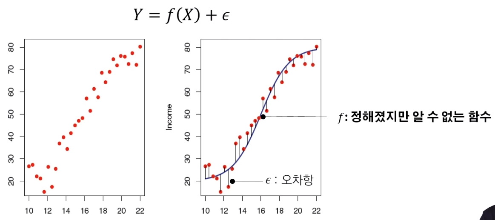

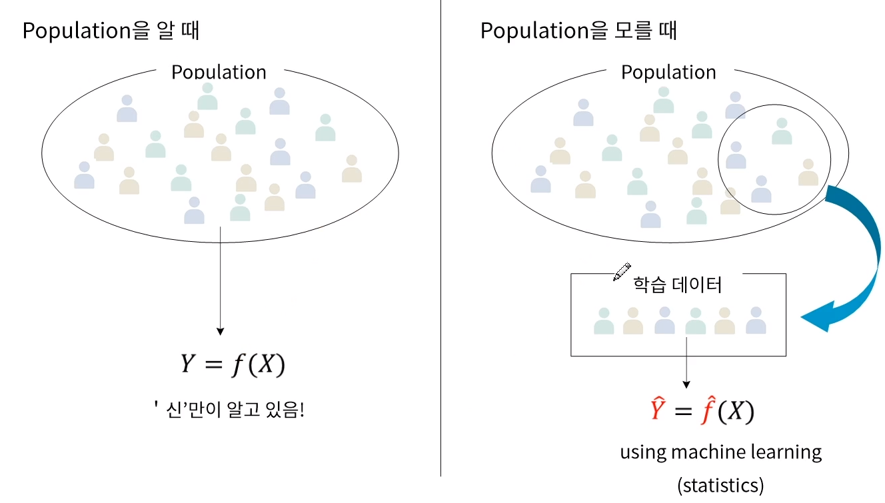

# 2. 지도학습과 비지도학습

## 2.1. 지도 학습(supervised learning)

Y = f(X) 에 대하여 입력 변수 (X)와 출력 변수(Y)의 관계에 대하여 모델링하는 것 (Y에 대하여 예측 또는 분류하는 문제)

- 회귀 (regression) : 입력 변수 X에 대해서 연속형 출력 변수 Y를 예측
- 분류 (classification) : 입력 변수 X에 대해서 이산형 출력 변수 Y(class)를 예측

Y가 연속형 변수이냐 이산형 변수(클래스)이냐로 구분

## 2.2. 비지도 학습(unsupervised learning)

- 출력 변수(Y)가 존재하지 않고, 입력 변수(X)간의 관계에 대해 모델링 하는 것
- 군집 분석 - 유사한 데이터끼리 그룹화
- PCA - 독립변수들의 차원을 축소화

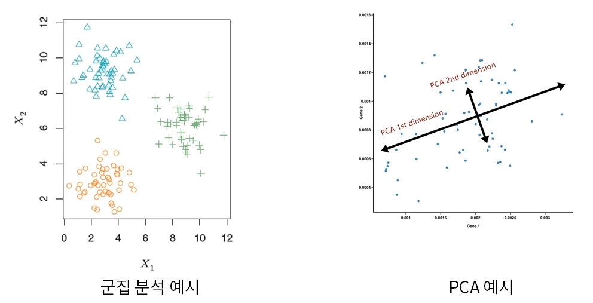

(현실에는 labeled data가 많지 않다)

## 2.3. 강화학습(reinforcement learning)

- 수 많은 시뮬레이션을 통해 현재의 선택이 먼 미래에 보상이 최대가 되도록 학습
- Agent가 action을 취하고 환경에서 보상을 받고 이 보상이 최대가 되도록 최적의 action을 취하는 방법을 배움

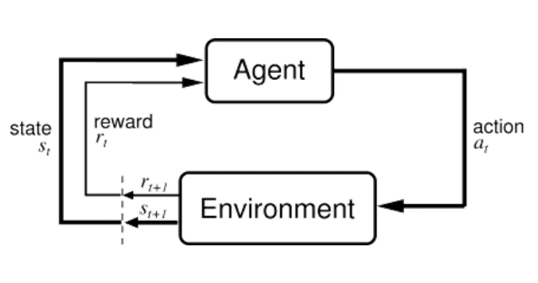

## 2.4. 정리

- 지도학습
  - Input/Output
  - Labeled data
  - ex) 주식가격 예측 (지도학습, 회귀)
  - ex) 공정 불량 여부 탐지 (지도학습, 분류)
- 비지도학습
  - Input
  - Unlabeled data
  - ex) 고객 segmentation (비지도 학습, 군집화)
- 강화학습
  - No data s
  - State & action
  - Simulation
  - Decision
  - ex) AlphaGo

# 3. Machine Learning의 종류

## 3.1. 선형 회귀분선 (Linear Regression)

- 독립변수와 종속변수가 선형적인 관계가 있다라는 가정하에 분석
- 직선을 통해 종속변수를 예측하기 때문에 독립변수의 중요도와 영향력을 파악하기 쉬움

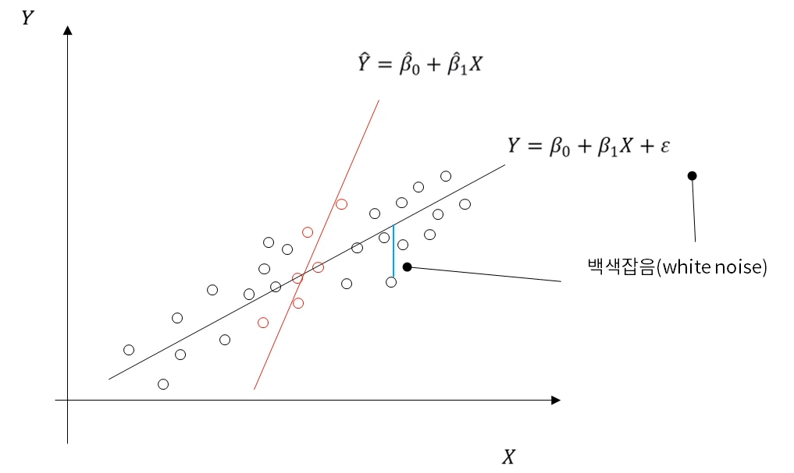

## 3.2. 의사결정나무 (Decision Tree)

- 독립 변수의 조건에 따라 종속변수를 분리 (비가 내리다 -> 축구를 하지 않는다)
- 이해하기 쉬우나 overfitting이 잘 일어남

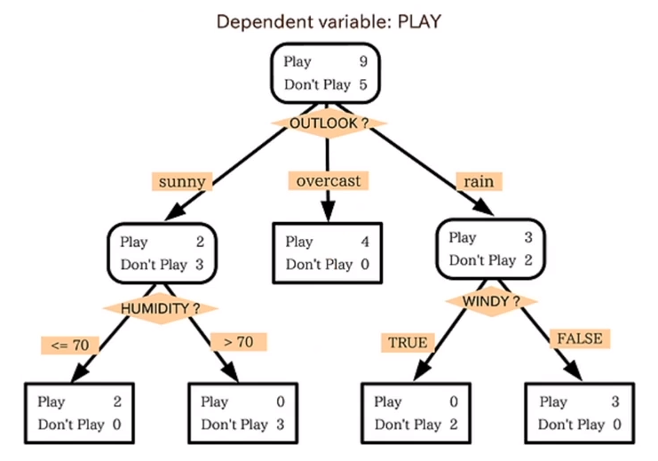

## 3.3. KNN (K-Nearest Neighbor)

- 새로 들어온 데이터의 주변 k개의 데이터의 class로 분류하는 기법

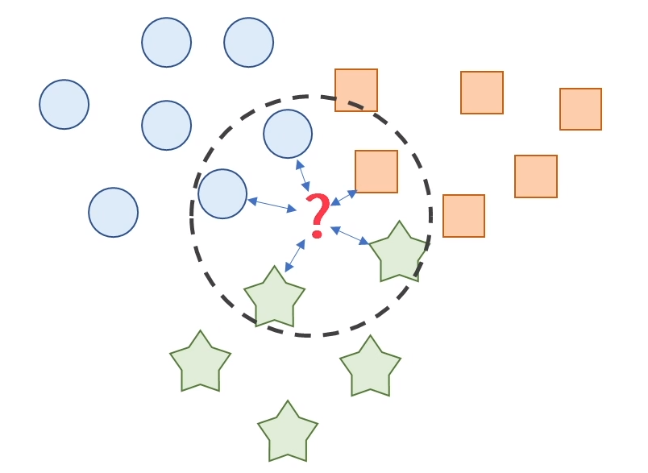

hyperparameter : 사람이 지정해 주어야 하는 변수

## 3.4. Neural Network

- 입력, 은닉, 출력층으로 구성된 모형으로서 각 층을 연결하는 노드의 가중치를 업데이트하면서 학습

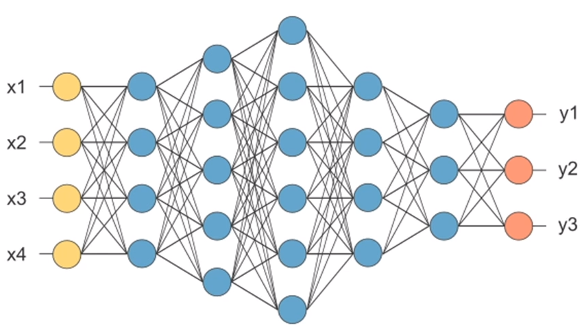

overfitting 되기 쉽다는 이유로 일찍부터 쓰이진 않았다.

## 3.5. SVM (Support Vector Machine)

- Class 간의 거리(amrgin)가 최대가 되도록 decision boundary를 만드는 방법

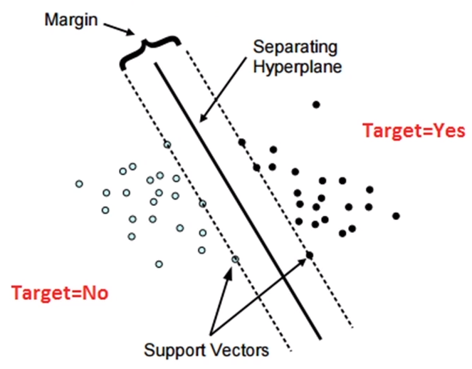

<strong>어느 정도의 오차를 허용한다.</strong>

요즘에는 잘 쓰이지 않는다.

학습에 오래 걸리는 모델이며, 데이터가 커질수록 시간은 훨씬 오래 걸린다.

## 3.6. Ensemble Learning

- 여러 개의 모델(classifier or base learner)을 결합하여 사용하는 모델

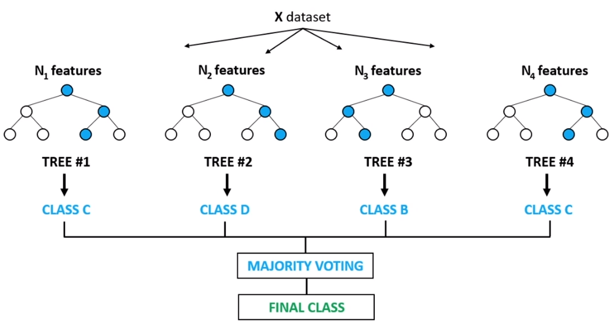

ex) 배깅?, random forest, boosting

## 3.7. K-means clustering

- Label 없이 데이터의 군집으로 k개로 생성

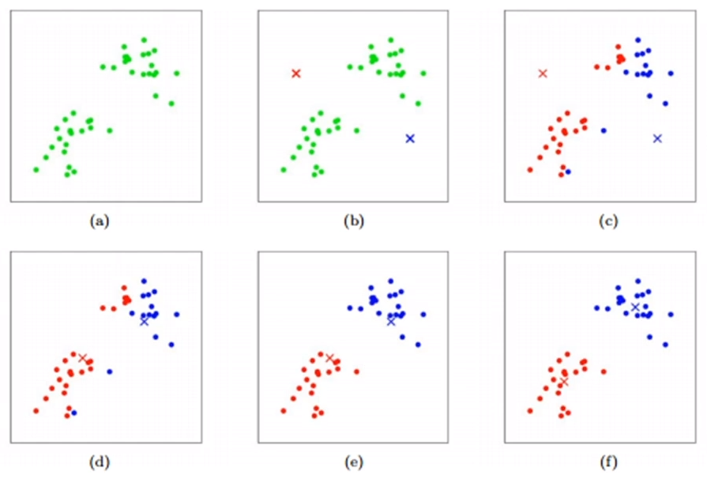

K를 알맞게 설정해주지 않으면 안된다.

데이터가 고차원일 경우 잘 맞지 않는다.

# 4. 딥러닝 주요 모델 - 1

## 4.1. Deep Learning

-  다층의 layer를 통해 복잡한 데이터의 학습이 가능토록 함 (graphical representation learning)
- 알고리즘 및 GPU의 발전이 deep learning의 부흥을 이끔

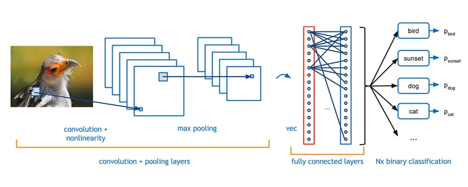

이미지 처리에 사용되는 CNN (Convolutional Neural Network)

### 4.1.1. 이미지 분류에서 기존 모델

- 각각의 픽셀 값(늘어뜨려서)을 독립변수로 사용
- 독립변수들을 각각 독립이라는 기본적인 가정에서 어긋남

### 4.1.2. Convolutional Neural Network

- 이미지의 지역별 feature를 뽑아서 neural network 학습
- Region feature (graphical feature)

### 4.1.3. RNN, AutoEncoder

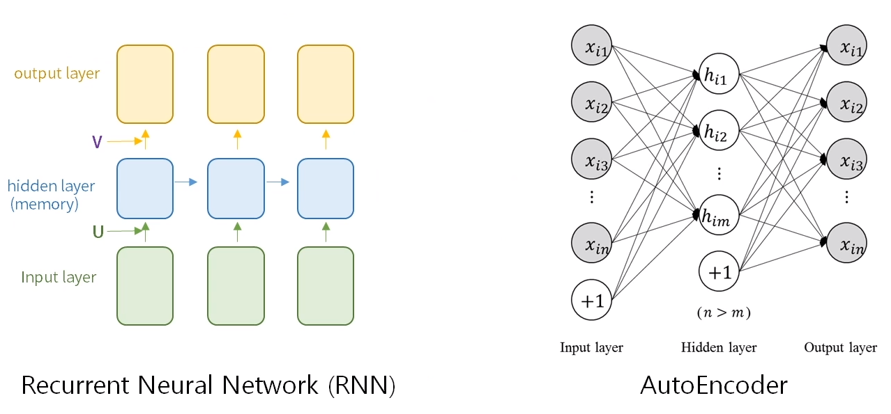

### 4.1.4. 다양한 분야로 발전한 딥러닝

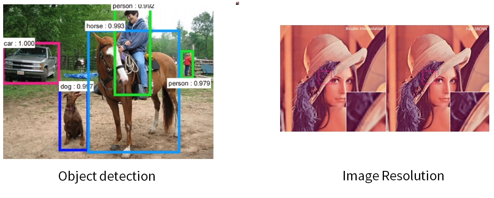

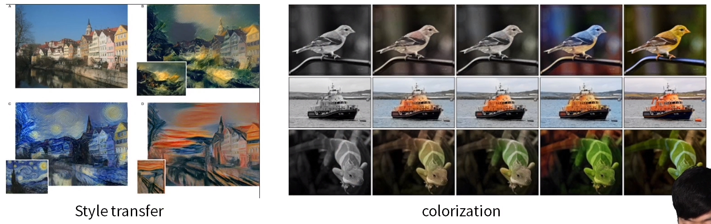

### 4.1.5. 네트워크 구조의 발전(ResNET, DenseNet 등)

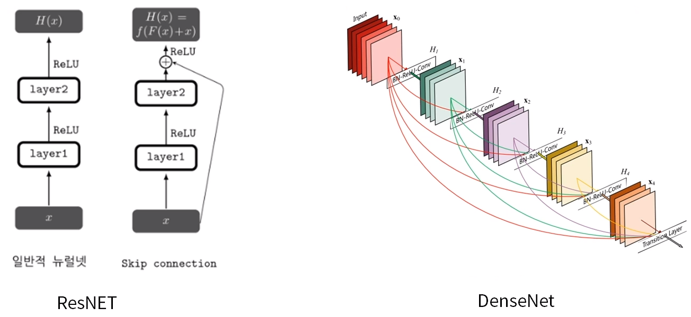

### 4.1.6. Deep Learning

- 네트워크 초기화 기법(Xavier, he initialization 등)
- 다양한 activation function(ReLu, ELU, SeLU, Leaky ReLU 등)
- Generalization, overfitting에 관한 문제
- Semi-supervised learning, Unsupervised learning

# 5. 딥러닝 주요 모델 - 2

## 5.1. GAN(Generative Adversarial Network)

Data를 만들어내는 Generator와 만들어진 data를 평가하는 Discriminator가 서로 대립(Adversarial)적으로 학습해가며 성능을 점차 개선해 나가자는 개념

- Discriminator를 학습시킬 때에는 D(x)가 1이 되고 D(G(z))가 0이 되도록 학습시킴

  (진짜 데이터를 진짜로 판별하고, 가짜데이터를 가짜로 판별할 수 있도록)

- Generator를 학습시킬 때에는 D(G(z))가 1이 되도록 학습시킴

  (가짜 데이터를 discriminator가 구분못하도록 학습, discriminator를 헷갈리게 하도록)

