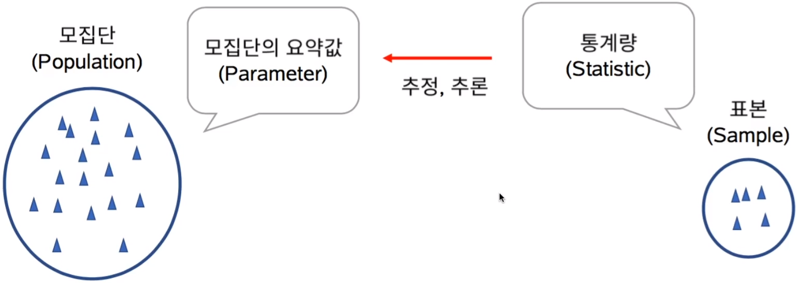

# 1. 수학적 개념 이해 - 통계적 개념, 자료의 종류, 자료의 요약

## 1.1. 통계학이란?

- 모집단 (Population): 연구의 대상이 되는 모든 개체들을 모은 집합.
  - 일반적으로 시간적, 공간적 제약으로 인해 모집단 전체를 대상으로한 분석은 불가능.
- 표본 (Sample): 모집단의 일부분의 관측값들.

- 모수 (Parameter): 수치로 표현되는 모집단의 특성.
- 통계량 (Statistic): 표본의 관측값들에 의해서 결정되는 양.

## 1.2. 자료의 종류

- 수치형 (양적자료)
  - 연속형 (예: 몸무게, 키)
  - 이산형 (예: 전화 통화 수)
- 범주형 (질적자료)
  - 순위형 (예: 학점)
  - 명목형 (예: 성별)

설명변수 => X

반응변수 => Y

## 1.3. 자료의 요약 - 그림, 표

- 범주형 자료
  - 도수 분포표
  - 막대 / 원형 그래프
- 연속형 자료
  - Box plot
  - 히스토그램 (Histogram)

# 2. 수학적 개념 이해 - 기술통계량, 추정량

## 2.1. 자료의 요약 - 수치

- 모집단 개체의 수: N

- 중심 경향값 (대표값)

  - $$
    평균 (Mean): \mu = \frac{x_1 + ... + x_N}{N} = \frac{\sum\limits_{i=1}^Nx_i}{N}
    $$

  - 중앙값 (Median): 크기순으로 정렬시켜 중앙에 위치한 값.

  - 최빈값 (Mode): 가장 자주 나오는 값.

- 산포도 (퍼진 정도)

  - $$
    분산 (Variance): \sigma^2 = \frac{\sum\limits_{i=1}^N(x_i - \mu)^2}{N}
    $$

  - 사분위수 범위 (Inter quartile range)

    - 전체 관측값을 크기순으로 정렬했을 때 중앙에 위치한 50%의 관측치가 가지는 범위

- 정규분포

  - 자연과학 현상을 설명할 때 가장 널리 쓰이는 분포.
  - 위치는 평균에 의해, 모양은 분산에 의해 결정.
  - 

- 분포도

  - 왜도 (Skewness)

    - 분포의 비대칭 정도
    - Left-skewed를 Negative skewed로 표현하기도 함.
    - 

  - 첨도 (Kurtosis)

    - 분포의 꼬리 부분의 비중에 대한 측도

    - 

    - $$
      K_s = 0
      $$

      - 뾰족한 정도가 정규분포와 동일

## 2.2. 통계량, 추정량

- 추정량 (Estimator): 모수를 추정하고자 하는 목적을 지닌 통계량.

- 추정량의 종류 (표본 관측치의 개수: n)

  - $$
    표본평균 : \bar{X} = \frac{\sum\limits_{i=1}^nx_i}{n}
    $$

  - $$
    표본분산 (Sample variance) : s^2 = \frac{\sum\limits_{i=1}^n(x_i - \mu)^2}{n-1}
    $$
    - 분산 식에서의 분모 N이 n-1이 된 것은 자료의 값의 중심의 영향을 받아 퍼진 정도가 작게 나타나기 때문에 이를 보정하기 위해 n-1로 나눔. 왜 하필 n-1이냐는 자유도에 대한 개념.

# 3. 수학적 개념 이해 - 확률의 기초

## 3.1. 확률 - 1

- 확률실험 (Random experiment): 다음과 같은 속성을 지닌 관찰이나 인위적인 실험
  - 실험의 결과는 미리 알 수 없다.
  - 실험에서 일어날 수 있는 모든 결과는 사전에 알려져 있다.
  - 이론적으로는 실험을 반복할 수 있다.
- 표본공간 (Sample space): 모든 결과들의 모임.
- 근원사건 (Sample outcome): 표본 공간의 원소.
- 사건 (Event): 표본 공간의 부분집합. 근원사건의 집합.
  - 배반 사건 (Mutually exclusive events): 서로 교집합이 공집합인 사건.

### 3.1.1. Ex) 주사위

- 확률실험 (Random experiment): 주사위를 던지는 시행. 주사위 눈의 숫자로 결과를 표시.
- 표본공간 (Sample space): S = {1,2,3,4,5,6}
- 근원사건 (Sample outcome): 1, ..., 6
- 사건 (Event): 짝수가 나오는 사건 A = {2,4,6}

### 3.1.2. Ex) 동전

- 확률실험 (Random experiment): 두 동전을 던지는 시행. H, T의 쌍으로 결과를 표시
- 표본공간 (Sample space): S = {(H,H), (H,T), (T,H), (T,T)}
- 근원사건 (Sample outcome): (H,H), (H,T), (T,H), (T,T)
- 사건 (Event): 짝수가 나오는 사건 A = {(H,H), (H,T), (T,H)}

## 3.2. 확률 - 2

- 어떠한 사건이 일어날 가능성의 정도

  - P({2,4,6}) = P(A)로 표기

- 근원사건이 일어날 가능성이 동일할 때의 계산,

  - $$
    P(A)=\frac{|A|}{|S|}=\frac{3}{6}=\frac{1}{2}
    $$

- 확률의 공리

  - 0 <= P(A) <= 1

  - P(S) = 1

  - 어떠한 사건들(Ai, i=1, ..., n)이 서로 배반사건일 때, 이 사건들의 합사건의 확률은 각각의 사건이 일어날 확률의 합과 같다.

    - $$
      모든 합사건 = \sum\limits_{i=1}^nP(A_i)
      $$

### 3.3. 조건부 확률, 독립

- 조건부 확률

  - 사건 B에 대한 정보가 주어졌을 때 사건 A의 교정된 확률

  - B가 주어졌을 때 사건 A의 조건부 확률

    - $$
      P(A|B) = \frac{P(A\cap B)}{P(B)}
      $$

    - 

- 독립

  - 사건 A와 B가 서로에게 아무런 영향을 미치지 않을 때.

  - P(A|B) = P(A), P(B|A) = P(B)

    - $$
      P(A\cap B) = P(A)P(B)
      $$

    - 

